# SchemaPilot 设计文档

## 1. 设计结论

SchemaPilot 要做成 **Oracle 到 PostgreSQL 的可视化迁移评估、转换、审核、执行平台**，而不是一个简单的建表和导数工具。

关键设计决策：

- 后端采用 **Java 25 + Spring Boot 4.x + 虚拟线程**，适合大量 JDBC 和文件 I/O。
- 后端采用 **Gradle 多模块单体**：运行时仍是一个 Spring Boot 应用，开发期按迁移能力拆 module，模块边界清楚，后续再拆 worker。
- 所有输入统一进入 **资产模型**：直连 Oracle、客户导出的文件夹/工程/zip、Data Pump SQLFILE、单文件、手工 SQL、应用工程 SQL、目标 PostgreSQL 反扫。
- SQL/PLSQL 转换分成两类：**可确定转换** 和 **辅助转换草稿**。
- PL/SQL、package、复杂 trigger 不承诺 100% 自动正确，必须进入风险和审核闭环。
- 预处理报告是核心门禁：**未审核通过，不允许正式执行**。
- 数据迁移走 PostgreSQL `COPY FROM STDIN`，配合 Oracle 流式读取、大表分片、虚拟线程并发、连接池限流。
- 大数据迁移缓冲第一版先使用有界 heap / direct buffer；**Java 25 FFM API** 作为 P1/P2 压测驱动的性能增强，通过特性开关灰度启用。
- 用户手工编辑后的目标 SQL 是执行基线，平台保存版本、diff、审核记录。
- AI 定位为 **项目级迁移智能层**：负责理解资产、规划波次、分析对象簇、生成改写草稿、诊断失败；规则、工具验证和人工审核负责兜底。
- 第一版优先做评估、转换、报告、审核；数据高速迁移作为第二个大闭环推进。

## 2. 产品定位

SchemaPilot 的价值不是说“我能自动迁完所有 Oracle”，而是：

> 把 Oracle 到 PostgreSQL 的迁移过程变得可见、可评估、可修改、可审核、可执行、可校验。

目标用户：

- DBA：关心对象完整性、性能、权限、执行窗口、回滚风险。
- 开发：关心 SQL、PL/SQL、视图、trigger、函数过程的改造成本。
- 架构师：关心兼容性风险、迁移策略、治理流程。
- 项目负责人：关心进度、报告、审核结论、风险清单。

### 2.1 闭环总览

平台必须形成五个闭环，每个闭环都有明确输入、处理动作、产物、门禁和下一步。

| 闭环 | 输入 | 平台动作 | 产物 | 门禁 | 下一步 |
|---|---|---|---|---|---|
| 资产闭环 | 直连 Oracle、文件夹/工程/zip、单文件、手工 SQL、应用工程 SQL、目标 PG | 采集、切分、识别、建模、缺失信息标记 | 统一对象清单和来源清单 | 对象可追溯到来源 | 依赖图、转换和风险 |
| 转换闭环 | 对象清单、规则配置 | 规则转换、AI 建议、人工编辑 | 目标 SQL 基线 | 用户确认目标 SQL | 报告 |
| 评审闭环 | 风险、目标 SQL、依赖、统计 | 生成预处理报告、审核 | 已审核报告快照 | 审核通过或有条件通过 | 计划 |
| 执行闭环 | 已审核 SQL 基线、迁移计划 | 执行 DDL、迁移数据、重试 | 执行日志和任务状态 | 失败项清零或豁免 | 校验 |
| 校验闭环 | 源库、目标库、执行结果 | 行数、抽样、checksum、对象校验 | 校验报告 | 差异处理完成 | 最终归档和问题回流 |

闭环原则：

- 每一步都保存版本和审计记录。
- 每个产物都能追溯到输入来源。
- 每个阶段都能生成阶段报告快照并导出；阶段报告用于沟通和审计，不一定都是执行门禁。
- AI 建议必须进入“接受、忽略、编辑”的决策链。
- 审核通过的报告和 SQL 基线冻结后，才能进入正式执行。
- 执行失败和校验失败必须回流到转换工作台或迁移计划，而不是停在错误日志里。

## 3. 支持范围

### 3.1 输入来源

| 输入来源 | 支持阶段 | 策略 |
|---|---|---|
| 手工 SQL | P0 | 走同一套解析、转换、风险和审核流程 |
| 单个 `.sql` 文件 | P0 | 解析 DDL 和 PL/SQL 块；DML/INSERT 保留原文并标记为不可直接执行的待处理 SQL |
| 文件夹 / 工程 / zip | P0 | 可一次导入多个工程包；递归读取 SQL/DDL/PLSQL/Data Pump SQLFILE/说明文件，保留工程名、路径、顺序、checksum 和 schema guess |
| Data Pump SQLFILE | P0 | 用户先用 `impdp SQLFILE=xxx.sql` 导出，平台按 SQL 文件处理 |
| 单独文件输入 | P0 | 作为轻量入口，可快速分析并选择加入项目 |
| Oracle 直连 | P1 | 采集元数据、对象 DDL、PL/SQL 源码、依赖、统计、NLS/版本信息 |
| 应用工程 SQL | P2/P3 | 支持多个应用工程；扫描 MyBatis XML、Java 字符串 SQL、配置文件、脚本、报表 SQL |
| 目标 PostgreSQL 反扫 | P2/P3 | 读取已存在目标对象，用于 gap analysis、二次迁移和校验 |
| INSERT 脚本 | P3 | 不进入 P0 DDL 基线执行链路；后续进入专用数据导入闭环 |
| CSV/Excel | P3 | 用于数据导入 |
| `.dmp` 文件 | 暂缓 | 不直接解析，提供操作向导 |

### 3.1.1 输入模式

入口可以轻重不同，但进入系统后必须进入同一套扫描、建模、风险和报告链路。轻量工作台不强制生成完整依赖图和迁移波次，大项目评估才进入完整依赖图、风险地图和波次规划。

| 模式 | 适用场景 | 入口 | 输出 |
|---|---|---|---|
| Quick Check | 小 SQL、临时验证 | 手工 SQL、单文件 | 对象识别、风险、改写建议 |
| Workbench | 多工程/多文件人工改造 | 多工程、多文件夹、多 zip | 工程树、来源树、对象清单、轻量资产模型、基础依赖、风险聚合、转换工作台、预处理报告 |
| Project Assessment | 大项目评估 | 直连 Oracle、客户导出多工程 | 工程分组、完整资产模型、完整依赖图、风险地图、迁移波次建议、人工工作量评估 |
| Migration Execution | 已审核迁移 | SQL 基线、源/目标库 | 迁移计划、执行日志、校验报告 |

多工程、文件夹/工程/zip 输入必须保留：

- 工程 ID、工程名称、工程类型，例如 `DATABASE_EXPORT`、`APPLICATION_SQL`、`MANUAL_BATCH`、`TARGET_POSTGRES`。
- 原始路径和相对路径。
- 文件类型和解析器选择。
- 文件 checksum。
- 语句在文件中的位置。
- 对象来源和 schema 推断依据。
- 缺失元数据标记，例如 row count、依赖、权限、NLS 信息无法从文件得出时必须显式标记。

### 3.1.2 输入预检

所有文件、文件夹和 zip 输入在进入解析前必须先经过预检。预检失败不能进入对象模型，只能生成输入问题。

预检内容：

- 最大单文件大小和批次总大小。
- zip bomb 检测，包括压缩比、展开文件数、展开后总大小。
- 非法路径拦截，例如 `../`、绝对路径、隐藏控制字符。
- 文件类型和扩展名白名单。
- 编码识别和不可识别编码提示。
- 重复文件 checksum 标记。
- 空文件、二进制文件、明显非 SQL 文件识别。
- Data Pump SQLFILE 的来源声明和导出参数提示。

### 3.1.3 多工程范围

一个 SchemaPilot 迁移项目可以包含多个工程单元。工程单元不是独立迁移项目，而是同一迁移项目内的来源分组，用于分区扫描、过滤、报告和回流。

典型组合：

- 多个数据库导出工程：不同 schema、不同业务域或不同客户交付包。
- 数据库导出工程 + 应用 SQL 工程：数据库对象和 MyBatis/Java/报表 SQL 同时评估。
- 多个 zip 包：客户按模块分包交付，平台需要统一建模和汇总报告。
- 源端工程 + 目标 PostgreSQL 反扫工程：用于差异分析和二次迁移。

多工程规则：

- 每个 `InputSource` 必须归属一个工程单元。
- 对象清单、风险、转换结果、报告都必须支持按工程过滤和汇总。
- 同名对象必须记录工程来源和 schema，不能只靠对象名合并。
- 跨工程依赖应标记为 `CROSS_SOURCE_DEPENDENCY`，轻量 Workbench 只提示，大项目评估再进入完整依赖分析。
- 阶段报告必须支持单工程导出和全项目汇总导出。

### 3.2 数据库对象

| 对象 | 第一版目标 |
|---|---|
| Table | 自动转换 |
| Column | 自动映射，可编辑 |
| Primary Key / Unique / Check | 自动转换 |
| Foreign Key | 自动转换，执行时可延后 |
| Index | 普通索引自动转换，函数索引标风险 |
| Sequence | 自动转换 |
| View | 简单视图自动转换，复杂视图标风险 |
| Trigger | 生成 PostgreSQL trigger function 草稿 |
| Function | 简单函数生成 PL/pgSQL 草稿 |
| Procedure | 简单过程生成 PL/pgSQL 草稿 |
| Package | 拆解识别，生成改造建议，不承诺自动完整转换 |
| Synonym | 生成处理建议 |
| Grant | 可选转换 |
| Comment | 自动转换 |
| Partition | 评估和草稿转换，复杂分区标风险 |

### 3.3 明确不支持与需人工处理矩阵

第一版必须把“不支持、只识别、只给草稿、可自动转换”写清楚，避免用户把平台误解成全自动迁移器。

| 能力 | MVP 处理方式 | 说明 |
|---|---|---|
| `.dmp` 直接解析 | 暂不支持 | 提供 Data Pump SQLFILE 操作向导，平台读取 SQLFILE |
| 完整 package 自动转换 | 不承诺 | 识别 spec/body、依赖和风险，生成拆解建议 |
| 动态 SQL 语义等价判断 | 人工处理 | 平台只能定位片段、解释风险、给草稿 |
| autonomous transaction | 人工处理 | 标记 HIGH/BLOCKER，进入 work item |
| DB link、AQ、Scheduler、Job | 只识别和风险提示 | 需要迁移策略人工确认 |
| 复杂物化视图刷新策略 | 只生成评估 | 不直接生成可执行刷新方案 |
| UDT、XMLTYPE、空间类型 | 只标风险 | 后续按行业样本补规则 |
| 分区完全等价迁移 | 草稿级 | 默认不承诺 Oracle 分区语义完全等价 |

### 3.4 版本兼容矩阵

项目必须保存源端和目标端版本，并在报告中说明规则适用范围。MVP 文档和测试 fixture 先按下列基线写验收：

| 组件 | 基线 | 说明 |
|---|---|---|
| Oracle | 11g / 12c / 19c 作为样本矩阵 | 直连能力在 P1 补齐；文件输入需保存来源声明 |
| PostgreSQL | 15 / 16 / 17 作为样本矩阵 | 目标语法预检和执行计划按版本生成差异 |
| Java | 25 | 使用虚拟线程；FFM 为后续性能增强 |
| Spring Boot | 4.x | 运行时一个 app，多模块开发 |

## 4. 总体流程

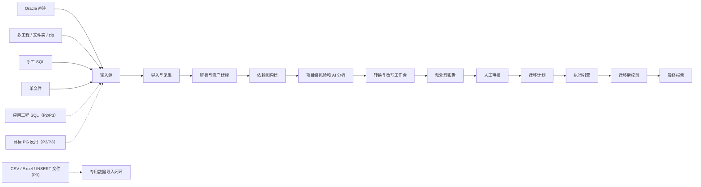

### 4.1 P0 闭环：评估转换闭环

P0 不追求完成真实生产迁移，而是必须让一个对象从输入到审核导出完整走完。

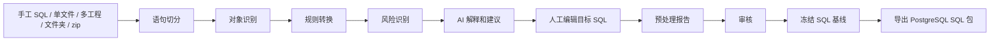

P0 的闭环验收：

- 输入可以是手工 SQL、单文件、单工程、多工程、文件夹或 zip。
- 多工程、文件夹/zip 输入能形成工程树和来源树，并能追溯到工程、文件路径和语句位置。
- P0 依赖图只要求覆盖文件和手工输入识别出的基础对象关系；Oracle 直连依赖采集属于 P1。
- 解析失败的片段不会丢失，必须形成 `ParseIssue`。
- 每个识别出的对象都能看到原始 SQL、目标 SQL、风险、AI 建议和人工编辑记录。
- 用户编辑后的目标 SQL 成为导出基线。
- 预处理报告能引用当前基线版本。
- 未审核通过不能导出正式 SQL 包。

### 4.2 P1 闭环：执行校验闭环

P1 才进入目标库执行。

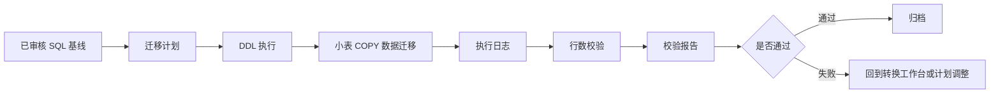

P1 的闭环验收：

- 迁移计划只能从已审核基线生成。
- DDL 执行失败能定位到对象和 SQL。
- 数据迁移失败能定位到表、批次或 shard。
- 校验失败能形成差异项，并能回流为待处理问题。

### 4.3 P2 闭环：迁移策略候选回流

P2 开始把审核和校验确认过的处理方式回流为项目策略候选。它服务迁移执行，不做与当前迁移无关的内容沉淀。

```text
人工修正 SQL
  -> 审核通过
  -> 执行成功
  -> 校验通过
  -> AI 建议抽取项目策略候选
  -> 用户确认适用范围
  -> 策略进入当前项目或项目模板
  -> 后续同类对象可提示或自动命中
```

策略候选必须人工确认适用范围，不能由 AI 自动写入全局生效规则。

### 4.4 P3 闭环：DML/INSERT 文件导入闭环

INSERT 脚本和 DML 文件不进入 P0/P1 的 DDL 基线执行链路，避免把数据写入和结构审核混在一起。P3 单独建立数据导入闭环：

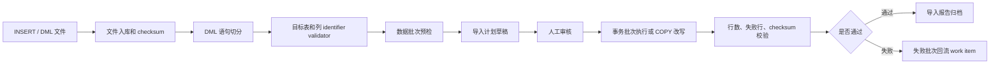

闭环定义：

- 入口：上传 `.sql`、`.txt` 中的 `INSERT`、`UPDATE`、`DELETE`、`MERGE`，或从 Data Pump SQLFILE 中识别出的 DML 片段。
- 风险：默认标记 `DML_REVIEW_REQUIRED`；包含函数调用、子查询、动态 SQL、未列名 INSERT、sequence/current time、LOB literal、大事务时提升风险等级。
- 产物：`dml_import_job`、`dml_batch`、`dml_parse_issue`、`dml_preview_report`、`dml_execution_log`、失败行样本、导入校验报告。
- 门禁：必须先完成目标结构审核和迁移计划；目标表、schema、column 必须通过 identifier validator；预检报告审核通过后才允许正式导入。
- 执行策略：小批量可用事务分批执行；大批量 INSERT 优先解析成行集并改写为 PostgreSQL `COPY FROM STDIN`；失败批次可单独重试。
- 失败回流：解析失败、identifier 不合法、目标列不存在、类型转换失败、唯一约束冲突、行数校验失败都必须生成 work item，不能只写日志。
- 验收用例：普通多行 INSERT、未列名 INSERT、包含单引号和 NULL、LOB/长文本、违反约束的失败批次、审核未通过禁止执行、执行后行数一致。

### 4.5 P3 闭环：架构风险硬化闭环

架构风险硬化不是单点优化，而是一组必须能进入报告、门禁、执行计划和回流的生产闭环。当前先进入设计和任务清单，后续按优先级实现。

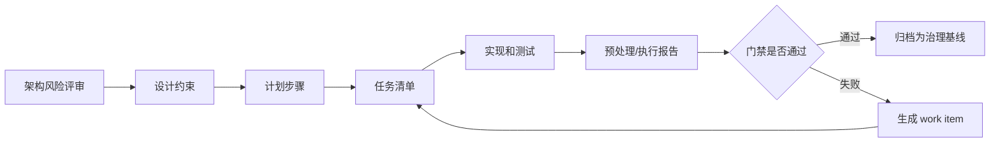

必须纳入该闭环的风险：

- 虚拟线程与连接池背压：虚拟线程不能绕过 JDBC、Oracle session、PostgreSQL COPY channel 等有限资源。
- FFM 堆外内存：必须有项目级预算、task/shard 预算、hard watermark、arena 泄漏检测。
- Oracle 语义：空字符串与 NULL、Sequence 游标同步、NLS/collation 差异必须进入预检。
- AI/Agent 边界：大型 PL/SQL/package 不能全文进入 LLM；Agent 必须有 MaxSteps、token/cost budget、retry budget。
- 报告信噪比：重复 LOW/MEDIUM 风险必须聚类折叠，BLOCKER/HIGH 置顶。
- 回滚与逆向校验：迁移计划必须设计 forward script、undo script、dry-run rollback preview、sequence position 校验。

门禁要求：

- 未配置 execution slot 与连接池容量关系时，不允许开启高并发迁移。
- FFM hard watermark 未配置时，不允许开启 FFM 模式下的 LOB/大表高并发 COPY。
- 未完成 Sequence Reset 计划时，不允许进入业务切换。
- 未生成 Undo Script 时，不允许正式执行高风险 DDL plan。
- 大型 PL/SQL 未完成 AST outline/slice 时，AI 只能给出风险摘要，不能生成可执行改造草案。

## 5. 状态机

### 5.1 项目状态

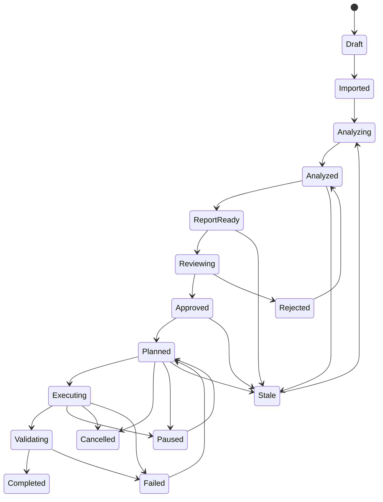

状态补充：

- `Stale`：输入批次、对象、规则、目标 SQL、报告或审核基线发生上游变化，下游报告、AI 建议、Migration Plan 和 SQL 包都必须失效。
- `Paused`：执行或计划被用户暂停，保留 checkpoint 和当前产物版本。
- `Cancelled`：用户主动取消，不允许继续复用旧计划执行，只能重新生成计划。
- `Failed`：执行或校验失败，必须生成 work item 并回流。

### 5.2 对象状态

```text
IMPORTED
  -> PARSED
  -> CONVERTED
  -> EDITED
  -> REVIEWED
  -> PLANNED
  -> EXECUTED
  -> VALIDATED
  -> STALE
```

对象可以停在任意状态。比如 package 可以停在 `CONVERTED`，但标记为 `MANUAL_REQUIRED`，等待开发人工处理。

风险和待处理问题支持 `WAIVED`，但豁免不是删除风险。`WAIVED` 必须记录豁免人、理由、有效范围、过期条件和关联报告版本；对象、规则或 SQL 变化后，相关豁免必须重新确认。

## 6. 技术架构

### 6.1 前端

- React
- TypeScript
- Vite
- Ant Design Pro
- Monaco Editor：SQL/PLSQL 编辑、diff、错误定位。
- React Flow：对象依赖图、迁移计划图。
- ECharts：资产统计、风险分布、迁移速度、校验结果。
- TanStack Query：服务端状态缓存。
- SSE 客户端：任务进度实时刷新。

### 6.2 后端

- Java 25
- Gradle Kotlin DSL multi-project
- Spring Boot 4.x
- Spring MVC
- Spring Security：P1 起补齐角色、权限和审批人策略；P0 先保留单用户/开发模式门禁。
- Spring Batch：不进入 P0 主链路，是否引入需要 ADR；P0 先用自研轻量任务表和状态机。
- Java FFM API：P1/P2 性能增强，使用 `MemorySegment`、`Arena`、`MemoryLayout` 做受控堆外缓冲，默认由特性开关控制。
- PostgreSQL JDBC
- Oracle JDBC Thin Driver
- PostgreSQL CopyManager
- Flyway 或 Liquibase
- ANTLR：PL/SQL 解析。
- JSqlParser 或 Apache Calcite：普通 SQL 解析。
- Redis 可选：分布式锁、任务进度、缓存。

推荐基础配置：

```yaml
spring:
  threads:
    virtual:
      enabled: true
  main:
    keep-alive: true
```

## 7. 后端模块

后端不是一个单 Gradle project 里按 package 随意分层，而是一个 Gradle multi-project。运行时只启动 `app` 一个 Spring Boot 应用；其他模块是 Java library module，由 `app` 依赖并装配。

```text
backend
  app            Spring Boot 启动、配置、模块装配、全局 Web 入口
  common         ApiResponse、异常、基础工具、通用审计类型
  project        迁移项目、工程单元 SourceProject、项目策略、项目状态
  datasource     数据源、连接测试、凭据管理
  input          手工 SQL、多文件、文件夹、zip、导入批次
  metadata       Oracle / PostgreSQL 资产扫描
  parser         SQL / PL/SQL 切分、解析、对象识别
  model          统一资产模型、来源追踪、对象版本
  dependency     基础依赖、跨工程依赖、完整依赖图和对象簇
  rule           规则定义、规则命中、规则说明
  convert        Oracle -> PostgreSQL 转换引擎
  ai             AI 迁移智能层、迁移上下文构建、建议管理
  risk           风险识别与评分，支持按工程过滤和汇总
  report         阶段报告、预处理报告、执行报告、校验报告、最终归档报告
  review         审核流程和门禁
  export         SQL 包导出
  planner        迁移计划生成
  executor       DDL 和数据执行
  validator      迁移后校验
  realtime       SSE 进度推送
  security       认证、权限、密钥保护
  audit          审计日志
```

MVP 必须先拆出的模块：

```text
app, common, project, input, parser, model, dependency, rule, convert, ai, risk, report, review, export
```

P1/P2 再补齐：

```text
datasource, metadata, planner, executor, validator, realtime, security, audit
```

模块依赖方向：

```text
app
  -> common
  -> project/input/parser/model/dependency/rule/convert/ai/risk/report/review/export

input -> project + common
parser -> model + common
dependency -> model + common
rule -> model + common
convert -> model + rule + common
risk -> model + rule + dependency + common
ai -> model + dependency + rule + convert + risk + common
report -> project + model + dependency + rule + convert + ai + risk + common
review -> report + common
export -> review + convert + common
```

约束：

- `app` 只负责启动、配置和装配，不承载业务逻辑。
- 业务模块不能反向依赖 `app`。
- `common` 不能依赖业务模块。
- `report` 不能依赖 `review`，避免和 `review -> report` 形成 Gradle 循环。Review Report 由 `review` 读取报告快照和审核记录生成，或由 `app` 编排导出。
- 模块之间只通过公开 service、DTO 或 domain type 协作，禁止跨模块直接访问内部实现类。
- Flyway 脚本第一阶段仍集中在 `app`，等模型稳定后再评估是否按模块拆 migration。

## 8. 统一资产模型

所有来源都转成统一模型，避免“直连一套逻辑、文件一套逻辑、手工输入一套逻辑”。多工程场景下，`Project` 是一次迁移工作的总容器，`SourceProject` 是该项目下的工程单元，`InputSource` 是工程单元里的具体输入来源。

核心实体：

```text
Project
SourceProject
DatasourceConfig
InputSource
InputBatch
DbObject
DbColumn
DbConstraint
DbIndex
DbTrigger
DbRoutine
DbPackage
DbView
DbSequence
ObjectDependency
ParseIssue
RiskIssue
ConversionResult
AiSuggestion
AiConversation
PromptTemplate
StageReport
PrecheckReport
ReviewRecord
MigrationPlan
MigrationTask
ExecutionReport
ValidationReport
FinalArchiveReport
AuditLog
```

核心层级：

```text
Project
  -> SourceProject
    -> InputSource / InputBatch
      -> DbObject
        -> ConversionResult / RiskIssue / ObjectDependency
```

`SourceProject` 用于表达客户交付的多个工程包或扫描来源：

- `DATABASE_EXPORT`：数据库对象导出工程，例如 Data Pump SQLFILE、DDL/PLSQL 文件夹。
- `APPLICATION_SQL`：应用侧 SQL 工程，例如 MyBatis XML、Java 字符串 SQL、报表 SQL。
- `MANUAL_BATCH`：手工 SQL 或临时验证批次。
- `TARGET_POSTGRES`：目标 PostgreSQL 反扫工程。

`InputBatch` 用于表达一次导入动作，例如一次 zip 上传、一次文件夹扫描、一次直连扫描快照。一个工程单元可以有多个批次，便于增量补充和重新扫描。

### 8.1 核心产物链路

闭环是否成立，关键看产物是否能串起来。

```text
SourceProject
  -> InputSource
  -> DbObject
  -> ParseIssue / RiskIssue
  -> ConversionResult
  -> AiSuggestion
  -> EditedSqlVersion
  -> StageReport
  -> PrecheckReport
  -> ReviewRecord
  -> MigrationPlan
  -> MigrationTask
  -> ExecutionReport
  -> ValidationReport
  -> FinalArchiveReport
```

每个产物必须至少记录：

- `project_id`：归属项目。
- `source_project_id`：归属工程单元；单 SQL、单文件也使用默认工程单元。
- `source_id` 或 `object_id`：来源。
- `input_batch_id`：归属导入批次，便于追踪 zip、文件夹扫描或直连扫描快照。
- `version`：版本。
- `status`：状态。
- `created_by` / `created_at`：审计。
- `input_hash`：用于判断报告或建议是否过期。

多工程建模规则：

- `DbObject` 不能只用对象名做唯一性判断，必须包含 `project_id`、`source_project_id`、schema、object type 和规范化名称。
- 文件输入对象必须保存文件路径、语句位置和 checksum。
- 直连扫描对象必须保存 owner、object name、Oracle object type 和采集快照。
- 跨工程依赖必须落为 `ObjectDependency`，并标记 `CROSS_SOURCE_DEPENDENCY`。
- 阶段报告、风险、转换结果、审核记录必须支持单工程过滤和全项目汇总。

### 8.2 SQL 基线模型

执行不能直接使用“最新生成 SQL”，必须使用审核冻结后的 SQL 基线。

```text
generated_sql：规则引擎生成结果
ai_suggested_sql：AI 建议结果
edited_sql：用户编辑结果
baseline_sql：审核冻结结果，执行和导出只能使用它
```

基线规则：

- 用户未编辑时，`baseline_sql` 可以来自 `generated_sql`。
- 用户接受 AI 建议后，必须先形成 `edited_sql`，再进入审核。
- 审核通过后生成 `baseline_sql`。
- 任何对象、规则、目标 SQL 修改后，关联报告和计划必须标记为过期。

`DbObject` 必须保存：

- 原始来源。
- 原始 SQL。
- 规范化模型 JSON。
- 解析状态。
- 转换状态。
- 风险等级。
- 源码位置，文件输入时记录行号范围。

## 9. Oracle 采集设计

Oracle 直连采集分两条线：

- 字典视图采集结构化元数据。
- `DBMS_METADATA` / 源码视图采集原始 DDL 和 PL/SQL 源码。

采集策略：

- 按 schema 扫描。
- 按对象类型并行扫描。
- 支持只扫描部分对象。
- 支持重新扫描并生成差异。
- 采集结果落库，避免每次打开页面都查 Oracle。
- 权限不足时不要失败整个项目，只记录权限风险。

需要特别处理：

- 大小写和引号标识符。
- NLS 字符集。
- `DATE` 的时间语义。
- `NUMBER` 精度。
- LOB 字段。
- 分区表。
- 物化视图。
- 私有/公共同义词。

## 10. 文件和手工 SQL 解析设计

SQL 解析不能只靠 `;` 分割，因为 PL/SQL 内部也有分号。

解析流水线：

```text
原始文本
  -> 预处理，去除不可见字符、识别编码
  -> 语句切分，识别 CREATE PACKAGE / TRIGGER / PROCEDURE 块
  -> 对象分类
  -> SQL AST 解析
  -> PL/SQL AST 或容错解析
  -> 风险提取
  -> 统一资产模型
```

解析失败策略：

- 保留原始 SQL。
- 记录失败位置。
- 生成 `ParseIssue`。
- 允许用户手工指定对象类型。
- 允许进入转换工作台做人工处理。

这点很重要：**解析失败不等于流程失败**。

### 10.1 导入批次对比

同一工程单元可能多次上传 zip、文件夹或 SQL 文件。平台必须支持批次对比，避免用户重新交付后不知道变化点。

批次对比至少包含：

- 新增文件、删除文件、内容变化文件。
- 新增对象、删除对象、SQL hash 变化对象。
- schema guess 或对象类型变化。
- 新增风险、消失风险、风险等级变化。
- 受影响的转换结果、报告和审核状态。

如果新批次改变了对象、风险或目标 SQL，相关报告和 SQL 基线必须标记为过期。

## 11. 转换引擎

转换引擎分层：

```text
ObjectConverter
  DdlConverter
  ViewConverter
  IndexConverter
  TriggerConverter
  RoutineConverter
  PackageAnalyzer

ExpressionRewriter
  FunctionMappingRule
  TypeMappingRule
  IdentifierRule
  DateTimeRule
  PaginationRule
  SequenceRule

Renderer
  PostgreSqlDdlRenderer
  PlpgsqlDraftRenderer
```

转换结果分级：

| 等级 | 含义 |
|---|---|
| AUTO | 可直接执行，但仍需审核 |
| REVIEW_REQUIRED | 能生成结果，但需要人工确认 |
| DRAFT | 只生成草稿，不建议直接执行 |
| MANUAL_REQUIRED | 必须人工改造 |
| UNSUPPORTED | 暂不支持 |

常见映射：

| Oracle | PostgreSQL 默认策略 | 说明 |
|---|---|---|
| `VARCHAR2(n)` | `varchar(n)` | 空字符串与 NULL 语义差异必须标风险 |
| `NVARCHAR2(n)` | `varchar(n)` | 需要记录源端字符集 / NLS 信息 |
| `NUMBER(p,0)` | `numeric(p,0)` | 不按位数默认降为 `integer` 或 `bigint` |
| `NUMBER(10,0)` | `numeric(10,0)` | 只有值域 profile 证明落在 `integer` 范围内，才给 `integer` 候选 |
| `NUMBER(19,0)` | `numeric(19,0)` | 只有值域 profile 证明落在 `bigint` 范围内，才给 `bigint` 候选 |
| `NUMBER(p,s)` | `numeric(p,s)` | 保留精度和 scale |
| `NUMBER` | `numeric` | 标记精度风险 |
| `DATE` | `timestamp` | 标记语义风险；Oracle `DATE` 含日期和时间 |
| `TIMESTAMP` | `timestamp` | 按目标版本检查 fractional seconds |
| `CLOB` | `text` | LOB 数据迁移进入专用测试 |
| `BLOB` | `bytea` | LOB 数据迁移进入专用测试 |
| `RAW` | `bytea` | 检查长度和编码 |
| `NVL(a,b)` | `COALESCE(a,b)` | 需检查类型提升差异 |
| `SYSDATE` | 生成候选并要求确认 | 不能默认写死为 `CURRENT_TIMESTAMP`；长事务或默认值场景可能需要 `clock_timestamp()`、statement timestamp 或应用侧时间 |
| `sequence.NEXTVAL` | `nextval('sequence')` | 执行计划必须包含 sequence reset |

类型和时间规则要求：

- 任何从 `numeric` 收窄到 `integer` / `bigint` 的建议都必须带值域证据、风险说明和人工确认，不得作为无条件 AUTO。
- `SYSDATE`、`SYSTIMESTAMP`、`CURRENT_DATE`、`CURRENT_TIMESTAMP` 等时间函数必须区分“事务开始时间、语句时间、真实当前时间、数据库服务器时区”四类语义。
- Oracle 空字符串等价 NULL 的差异必须进入转换规则和 COPY/DML 数据写入策略；默认策略为 `ORACLE_EMPTY_STRING_AS_NULL`，但报告必须列出受影响字段和 SQL。
- Sequence 转换只解决对象创建，不代表游标位置正确；数据导入后必须执行 sequence reset。

### 11.1 PostgreSQL 语法预检

P0 不执行 DDL，但需要尽早发现目标 SQL 明显不可用的问题。转换工作台应提供 PostgreSQL 语法预检能力：

- 对目标 SQL 做 PostgreSQL 方言语法检查。
- 检查 identifier 是否需要引用或存在非法字符。
- 检查明显不支持的 Oracle 语法残留。
- 检查多语句顺序是否缺少依赖对象。
- 预检结果进入风险和待处理问题，不直接阻止用户编辑。

P0 可以先使用轻量 parser 和规则检查；P1 接入目标 PostgreSQL 后，再增加 dry-run 或事务内 rollback 校验。

## 12. PL/SQL 策略

PL/SQL 是最大风险点，必须诚实设计。

### 12.1 Trigger

Oracle trigger：

```sql
CREATE OR REPLACE TRIGGER trg
BEFORE INSERT ON t
FOR EACH ROW
BEGIN
  :NEW.created_at := SYSDATE;
END;
/
```

PostgreSQL 需要拆成：

```text
CREATE FUNCTION trg_fn() RETURNS trigger ...
CREATE TRIGGER trg BEFORE INSERT ON t FOR EACH ROW EXECUTE FUNCTION trg_fn();
```

第一版支持简单 `:NEW`、`:OLD`、`BEFORE/AFTER INSERT/UPDATE/DELETE`。

复杂 trigger 标风险：

- compound trigger。
- statement-level + row-level 混合。
- autonomous transaction。
- 调用 package 全局状态。

### 12.2 Function / Procedure

第一版支持：

- 参数识别。
- 返回值识别。
- 简单变量声明。
- 简单 SQL 语句。
- 常见函数替换。

标风险：

- 游标复杂循环。
- 动态 SQL。
- 异常处理语义差异。
- bulk collect / forall。
- Oracle 内置包。

### 12.3 Package

package 不当成“自动转换对象”，而当成“改造单元”。

处理方式：

- 解析 package spec 和 body。
- 提取函数、过程、类型、常量、变量。
- 生成拆解建议。
- 对可独立转换的 routine 生成草稿。
- 对全局状态、初始化逻辑、重载函数标风险。

## 13. 风险评估

风险等级：

- `LOW`：自动转换概率高。
- `MEDIUM`：需要确认。
- `HIGH`：需要人工改造。
- `BLOCKER`：阻塞执行。

风险类型：

- 语法风险。
- 类型风险。
- 语义风险。
- 性能风险。
- 权限风险。
- 执行顺序风险。
- 数据一致性风险。

典型风险：

- `NUMBER` 无精度。
- `NUMBER(10,0)` / `NUMBER(19,0)` 被错误收窄到 `integer` / `bigint`。
- Oracle 空字符串等价 NULL。
- `DATE` 包含时间。
- `SYSDATE` 与 PostgreSQL 事务时间函数语义不一致。
- `ROWNUM`。
- `CONNECT BY`。
- `DECODE`。
- 老式外连接 `(+)`。
- Oracle hint。
- 分区表。
- 函数索引。
- materialized view。
- package 全局变量。
- autonomous transaction。
- `SECURITY DEFINER`、owner、grant 和 search_path 安全差异。

### 13.1 规则命中解释

风险不是只显示一个等级。每条风险都必须能解释“为什么命中、影响什么、建议怎么处理”。

规则命中解释至少包含：

- 命中规则编号和名称。
- 风险等级和是否阻塞。
- 原始 SQL/PLSQL 片段。
- 涉及对象和依赖对象。
- Oracle 与 PostgreSQL 的语义差异。
- 系统建议改法和人工确认点。
- 是否已被用户豁免。

前端应提供规则命中解释页或侧边栏，用户从风险列表、转换工作台、预处理报告都能跳转到同一个解释视图。

### 13.2 待处理问题板

平台需要一个统一待处理问题板，把技术问题和审核问题集中起来，而不是散落在解析日志、风险列表、AI 建议和报告里。

问题来源：

- `ParseIssue`。
- `RiskIssue`。
- PostgreSQL 语法预检问题。
- AI 输出的 `uncertainties`。
- 审核意见。
- 执行失败和校验差异。

问题字段：

- 来源阶段。
- 关联工程、输入批次、对象、SQL 版本。
- 严重等级。
- 状态：open、in_progress、resolved、waived。
- 负责人。
- 处理说明。

## 14. AI 迁移智能层设计

AI 不是迁移执行器。AI 的价值是基于扫描结果、依赖图、规则命中、项目策略和执行反馈，帮助用户理解大项目、规划迁移、生成改写草稿并诊断失败。平台必须保留确定性规则引擎、SQL parser、dry-run、执行器和人工审核作为可信边界。

AI 的闭环不是“问一下模型”，而是：

```text
扫描和建模
  -> 构建依赖图
  -> 规则和风险命中
  -> 构建迁移上下文
  -> AI 项目/对象/片段分析
  -> 工具验证
  -> 用户接受 / 忽略 / 编辑
  -> 写入审计
  -> 影响转换草稿或报告摘要
  -> 重新生成报告或标记报告过期
```

AI 建议只有被用户接受或编辑后，才可能影响后续产物。

### 14.1 AI 能力范围

第一版适合做：

- 项目级评估：根据对象清单、风险分布和依赖关系生成迁移范围摘要、阻塞项和人工工作量提示。
- 解释风险：把 `NUMBER`、`DATE`、`ROWNUM`、package 全局变量等风险翻译成人能看懂的影响和处理建议。
- SQL 改造建议：对单条 SQL、view、trigger、function/procedure 给出 PostgreSQL 改造思路。
- PL/SQL 草稿增强：在规则引擎草稿基础上补充说明和待确认点。
- 对象簇分析：对一组互相依赖的 view/procedure/package 先给改造方案，再进入单对象草稿。
- 报告摘要：为预处理报告生成管理层摘要、DBA 摘要、开发改造清单摘要。
- 错误解释：解释解析失败、转换失败、执行失败的可能原因。
- 验证建议：为复杂 view、function、trigger 生成 dry-run、样例数据、行数/结果对比建议。

后续增强：

- 结合对象依赖图生成迁移波次建议。
- 根据执行日志诊断失败 SQL。
- 根据校验差异生成排查建议。
- 支持自然语言问答，例如“哪些对象阻塞上线？”、“哪些 package 最危险？”。

### 14.2 AI 不允许直接做的事

- 不允许未经审核直接执行 AI 生成的 SQL。
- 不允许把 AI 输出自动覆盖用户编辑后的执行基线。
- 不允许把数据库密码、连接串、密钥放入提示词。
- 不允许在没有引用原始对象和风险证据时给出“已完全兼容”的结论。
- 不允许 AI 决定审核通过。

### 14.3 AI 架构

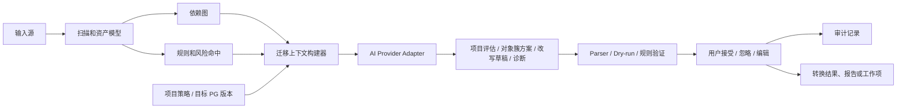

核心模块：

```text
AiProvider
  OpenAIProvider
  PrivateModelGatewayProvider
  MockProvider

AiContextBuilder
  ProjectMigrationContextBuilder
  DependencyGraphContextBuilder
  ObjectClusterContextBuilder
  ObjectContextBuilder
  ReportContextBuilder
  ErrorContextBuilder

AiSuggestionService
  assessProject()
  planMigrationWaves()
  analyzeObjectCluster()
  explainRisk()
  suggestConversion()
  suggestValidation()
  summarizeReport()
  diagnoseError()
```

### 14.4 上下文构建

AI 输入必须小而准，不能把整个数据库对象一股脑塞给模型。

上下文包建议包含：

- 输入来源类型：直连、文件夹/zip、单 SQL、应用工程 SQL、目标库反扫。
- 对象类型、对象名、schema。
- 原始 Oracle SQL。
- 规则引擎生成的 PostgreSQL SQL。
- 风险清单。
- 依赖对象摘要和当前对象所在对象簇。
- 用户已编辑内容。
- 目标 PostgreSQL 版本。
- 项目规则配置。
- 缺失信息清单，例如文件输入缺少 row count、权限、统计信息。

对大对象采用：

- 分块摘要。
- 只传相关片段。
- 先由 parser、规则引擎和依赖图定位风险片段，再让 AI 解释和规划。
- 保存 AI 请求和响应的哈希、模型名、提示词版本。

### 14.5 迁移上下文

SchemaPilot 运行时需要的是迁移上下文：

- 当前项目资产模型。
- 依赖图和对象簇。
- 规则命中和风险证据。
- 项目迁移策略。
- 用户已确认的 SQL 基线。
- 执行日志、校验差异和失败回流。

第一版必须先把当前项目上下文做准确。AI 的判断依据只来自当前项目的结构化事实、规则命中、风险、依赖、转换结果、报告快照和人工审核记录。

### 14.5.1 上下文边界

上下文分三层：

| 层 | 内容 | 是否必须 | 用途 |
|---|---|---|---|
| 确定性上下文 | 对象模型、依赖图、风险命中、策略配置、SQL 版本 | 必须 | 让 AI 知道当前项目事实 |
| 规则证据 | 类型/函数/语法差异说明、内置迁移规则、官方出处摘要 | 必须 | 解释为什么需要改 |
| 运行反馈 | 解析问题、转换问题、审核意见、执行失败、校验差异 | P1/P2 | 让 AI 诊断失败并生成待处理建议 |

MVP 不建立独立外部参考增强主链路。后续如接入外部文档、工单或代码仓库，也必须作为受信数据源进入项目上下文，不能影响 P0/P1 主闭环。

### 14.5.2 AI 输出形态

AI 输出必须结构化，至少包含：

- `summary`：总体判断。
- `ruleHits`：引用系统已命中的规则或风险，不能凭空编造。
- `affectedObjects`：涉及对象和依赖对象。
- `changePlan`：建议改动步骤。
- `sourceSnippets`：原始 SQL/PLSQL 片段。
- `targetDraft`：目标 PostgreSQL SQL/PLpgSQL 草稿，可为空。
- `validationPlan`：建议如何验证。
- `uncertainties`：需要人工确认的点。
- `confidence`：置信度。

### 14.5.3 大项目分层

大项目不能只做单对象 AI 建议，必须分层：

```text
ProjectMigrationBrain
  -> Schema / Domain Analyzer
  -> DependencyGraphAnalyzer
  -> MigrationWavePlanner
  -> ObjectClusterAdvisor
  -> ObjectRewriteAdvisor
  -> ValidationDiagnosisAgent
```

### 14.5.4 安全和隔离

- 默认不把项目 SQL 和对象摘要跨项目复用。
- 数据库连接串、密码、IP、业务敏感字段不得进入 AI 提示词、响应、日志或审计明细。
- AI 回答必须标明依据来自对象模型、规则命中、依赖图、报告快照还是执行/校验反馈。
- 企业私有化部署时支持关闭外部 LLM provider，关闭后平台仍可完成规则转换、报告、审核和导出。

### 14.6 数据模型

建议新增：

```text
ai_provider_config
  provider_type
  endpoint
  model_name
  encrypted_api_key
  enabled

prompt_template
  code
  version
  purpose
  template_text

ai_suggestion
  project_id
  object_id
  suggestion_type
  prompt_version
  model_name
  input_hash
  output_json
  evidence_refs
  status
  accepted_by
  accepted_at

ai_conversation
  project_id
  object_id
  title
  created_by

ai_message
  conversation_id
  role
  content
  created_at
```

### 14.7 审计和安全

- AI 请求前必须脱敏连接串、密码、密钥。
- AI 建议必须保存版本。
- 用户接受 AI 建议必须记录审计日志。
- AI 输出进入转换结果前必须经过人工确认。
- 支持关闭 AI，平台仍可用规则、parser、依赖图、报告和人工工作台运行。
- AI provider 可以是企业模型网关、云端模型、本地模型或 mock，不强制绑定某个本地运行时。
- 对企业场景预留私有模型网关。

### 14.8 AI 建议状态机

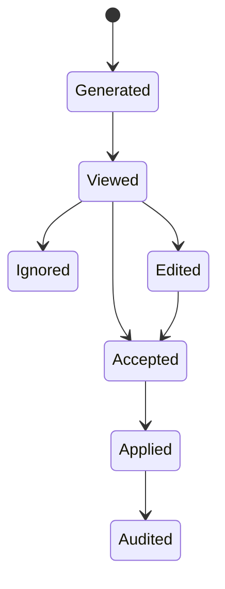

状态含义：

- `Generated`：模型已生成，尚未被用户查看。
- `Viewed`：用户已查看。
- `Accepted`：用户接受原建议。
- `Ignored`：用户忽略建议。
- `Edited`：用户基于建议进行了修改。
- `Applied`：建议影响了目标 SQL、报告摘要或处理建议。
- `Audited`：审计日志已记录。

### 14.9 UI 形态

适合放在这些位置：

- 项目 dashboard：`项目迁移分析`、`阻塞项解释`、`迁移波次建议`。
- 依赖图页：`解释依赖链`、`识别对象簇`、`定位阻塞对象`。
- 转换工作台右侧：`解释风险`、`优化转换`、`生成改造说明`。
- 预处理报告页：`生成摘要`、`生成开发改造清单`。
- 执行监控页：`解释失败原因`、`建议重试策略`。
- 对象清单页：`询问此对象`。

## 15. Agent、MCP 和 Skills 设计

SchemaPilot 可以引入 Agent、MCP 和 Skills，但它们必须服务于迁移闭环，不能绕过规则、审核和 SQL 基线。

三者分工：

| 层 | 定位 | 例子 | 产物 |
|---|---|---|---|
| Agent | 有状态的任务编排者 | 项目评估 Agent、依赖分析 Agent、对象簇改造 Agent、校验诊断 Agent | `WorkItem`、`AiSuggestion`、`ConversionResult` |
| MCP | 工具和上下文协议层 | 暴露对象、报告、工具；调用外部文档、工单、代码仓库 | 工具调用记录、资源快照 |
| Skill | 可复用迁移能力包 | `oracle-trigger-to-pg`、`rownum-rewrite`、`package-analyzer` | 规则、提示词、测试、输出 schema |

原则：

- Agent 只能在授权范围内调用工具。
- MCP 工具必须 allowlist、限时、限参、审计。
- Skill 必须版本化，有适用条件和测试样例。
- Agent 和 Skill 产生的是建议、草稿或任务，不能直接替代审核。
- 任何影响执行 SQL 的结果都必须进入 SQL 版本和报告审核链路。

### 15.1 Agent 分层

MVP 不做完全自主的多 Agent 系统，先做窄职责 Agent。

推荐 Agent：

| Agent | 职责 | 可调用能力 | 禁止事项 |
|---|---|---|---|
| ProjectAssessmentAgent | 汇总对象、风险、兼容性和缺失信息 | 对象查询、风险规则、依赖图、迁移上下文 | 不修改 SQL |
| DependencyGraphAgent | 解释依赖链、识别阻塞对象和对象簇 | 依赖图、对象模型、调用关系 | 不改变迁移计划状态 |
| ObjectClusterAdvisor | 对相关 view/procedure/package 生成改造方案 | 对象簇、转换规则、Skill、LLM | 不直接改写基线 |
| ConversionAgent | 对单个对象生成转换建议 | 转换规则、Skill、迁移上下文、LLM | 不冻结基线 |
| ReviewAgent | 生成审核摘要和待确认项 | 报告、风险、diff、迁移上下文 | 不决定审核通过 |
| ExecutionPlannerAgent | 生成迁移计划建议 | 依赖图、基线 SQL、执行模式 | 不直接执行 |
| ErrorDiagnosisAgent | 解释解析、转换、执行、校验错误 | 日志、对象、规则证据、迁移上下文 | 不自动重试生产任务 |

Agent 输出统一落库：

```text
agent_run
  id
  project_id
  agent_type
  trigger_type
  input_ref
  status
  started_at
  finished_at

agent_step
  run_id
  step_type
  tool_name
  input_hash
  output_ref
  status

work_item
  project_id
  object_id
  source
  title
  severity
  status
  suggested_action
```

Agent 状态机：

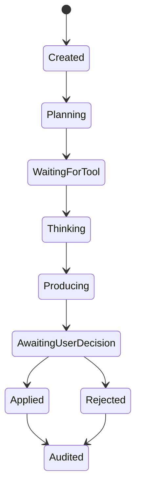

### 15.2 MCP 设计

SchemaPilot 同时可以是 MCP Server 和 MCP Client。

作为 MCP Server，向内部 Agent 或外部受信客户端暴露：

- Resources：项目、输入源、对象、依赖图、风险、报告、执行日志。
- Tools：扫描输入源、解析 SQL、构建依赖图、转换对象、查询规则证据、生成报告摘要、诊断错误。
- Prompts：风险解释、PL/SQL 改造、报告摘要、错误诊断等模板。

作为 MCP Client，可选连接：

- 内部文档或迁移规范。
- 工单系统。
- Git 仓库。
- 企业模型网关。
- 受信的外部迁移工具。

MCP 暴露示例：

```text
Resources
  schemapilot://projects/{projectId}/objects/{objectId}
  schemapilot://projects/{projectId}/reports/precheck/{reportId}
  schemapilot://projects/{projectId}/dependency-graph

Tools
  scanProjectObjects(projectId)
  parseOracleSql(inputSourceId)
  buildDependencyGraph(projectId)
  convertObject(objectId, skillCode)
  explainRisk(riskIssueId)
  buildMigrationContext(objectId, scope)
  generatePrecheckSummary(reportId)
  diagnoseExecutionError(taskStepId)

Prompts
  oracle-risk-explanation
  plsql-to-plpgsql-draft
  precheck-executive-summary
  migration-error-diagnosis
```

安全要求：

- 默认只启用内部 MCP Server。
- 外部 MCP Client 功能默认关闭。
- 所有 MCP tools 必须配置 allowlist。
- 远程 MCP 只采用 Streamable HTTP；旧版远程传输不作为生产目标协议。
- STDIO 只用于本地开发和受信工具。
- 远程入口必须校验 Origin、认证身份、项目权限和 tool allowlist。
- 长任务必须用任务资源表达状态、TTL、取消、结果获取和失败原因，不能让 Agent 无限等待。
- 工具参数必须 JSON Schema 校验。
- 工具调用必须有超时、重试上限和审计日志。
- 写操作工具默认 dry-run，正式写入必须走审核门禁。
- MCP 返回内容必须脱敏。

### 15.3 Skills 设计

Skill 是可复用迁移能力包，不是纯 prompt。

一个 Skill 包含：

```text
skill.yaml
rules/
prompts/
context/
tools/
fixtures/
tests/
docs/
```

`skill.yaml` 示例：

```yaml
code: oracle-trigger-to-postgres
version: 1.0.0
objectTypes:
  - TRIGGER
riskTypes:
  - TRIGGER_BODY
inputs:
  - originalSql
  - objectMetadata
  - dependencySummary
outputs:
  schema: TriggerConversionResult
allowedTools:
  - buildMigrationContext
  - renderPostgresSql
requiresReview: true
```

第一批内置 Skills：

| Skill | 用途 |
|---|---|
| `oracle-table-ddl` | 表、字段、约束转换 |
| `oracle-index-sequence` | 索引和 sequence 转换 |
| `oracle-view-sql` | view SQL 转换和风险识别 |
| `oracle-trigger-to-postgres` | trigger function 草稿 |
| `plsql-procedure-draft` | procedure/function 草稿 |
| `oracle-package-analyzer` | package 拆解和风险分析 |
| `rownum-pagination-rewrite` | ROWNUM 改写 |
| `connect-by-analysis` | 层级查询风险和改写建议 |
| `data-copy-tuning` | COPY 参数和分片建议 |
| `validation-diagnosis` | 校验差异诊断 |

Skill 执行流程：

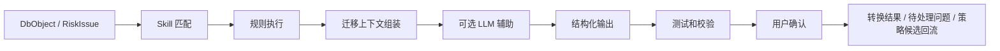

Skill 上线门禁：

- 必须有 fixture。
- 必须有输出 schema。
- 必须声明允许调用的 MCP tools。
- 必须声明是否需要审核。
- 必须有版本号和 changelog。
- 高风险 Skill 默认只能生成草稿。

### 15.4 Java 实现建议

Java-first 实现：

```text
AgentRuntime：自研轻量状态机
SkillRegistry：扫描内置和插件 Skill
ToolRegistry：统一 MCP tool 和本地 tool
McpGateway：Spring AI MCP Client/Server 适配
SkillExecutor：规则 + 迁移上下文 + 可选 LLM + schema validation
AgentAuditService：记录 agent/tool/skill 全链路
```

不建议 MVP 使用复杂的自主 Agent 框架。先用确定性状态机和任务表，把 Agent 做成可暂停、可重试、可审计的后台任务。

## 16. 报告体系

报告不是附属功能，是平台核心。SchemaPilot 要支持每个阶段导出报告，但不同报告的门禁意义不同。

### 16.1 阶段报告

每个阶段都可以生成快照报告并导出，至少包括：

| 阶段 | 报告 | 内容 | 是否门禁 |
|---|---|---|---|
| 输入扫描 | Source Scan Report | 输入来源、文件树、checksum、解析状态、缺失信息 | 否 |
| 资产建模 | Asset Model Report | 对象清单、来源位置、轻量资产模型、基础依赖 | 否 |
| 转换改造 | Conversion Report | 原 SQL、目标 SQL、转换等级、人工编辑、AI 建议引用 | 否 |
| 风险预检 | Precheck Report | 风险、阻塞项、兼容性评分、建议处理方式 | 是，正式执行前必须审核 |
| 审核 | Review Report | 审核结论、意见、豁免项、冻结基线版本 | 是，正式执行前必须通过 |
| 迁移计划 | Migration Plan Report | 执行步骤、依赖顺序、执行模式、回滚/重试策略 | 是，正式执行前必须确认 |
| 执行 | Execution Report | 执行日志、失败步骤、重试、耗时、吞吐、资源指标 | 否，失败时生成回流问题 |
| 校验 | Validation Report | 行数、抽样、checksum、对象存在、差异项 | 是，归档前必须处理差异 |
| 最终归档 | Final Archive Report | 报告汇总、SQL 基线、执行结果、校验结论、剩余风险 | 是，项目关闭前必须生成 |

阶段报告规则：

- 报告必须是快照，引用输入源、对象、转换结果、风险、AI 建议、审核记录或执行日志的具体版本。
- 阶段报告可以随时导出，格式第一版至少支持 HTML/JSON，后续支持 PDF/Word/Excel。
- 只有 Precheck、Review、Migration Plan、Validation、Final Archive 报告承担门禁职责。
- 任一上游产物变更后，相关下游报告必须标记为过期或重新生成。
- AI 可以生成摘要，但报告结论必须来自规则、执行结果、校验结果和人工审核。

### 16.2 预处理报告

预处理报告是正式执行前的核心门禁报告。

报告内容：

- 项目摘要。
- 输入来源摘要。
- 对象统计。
- 数据量估算。
- 大表清单。
- 兼容性评分。
- 风险分布。
- 高风险对象清单。
- 类型映射清单。
- SQL/PLSQL 问题清单。
- 对象依赖图。
- 建议迁移顺序。
- 建议执行模式。
- 建议并发参数。
- 阻塞项。
- 审核结论。

预处理报告是快照。报告生成后，如果对象、规则或目标 SQL 被修改，报告需要重新生成或标记为过期。

AI 可参与生成报告摘要和建议处理方式，但报告结论仍来自规则引擎、风险评估和人工审核。

### 16.3 报告差异

同一阶段报告可以重新生成。平台必须能告诉用户“这次报告和上次相比变化了什么”，避免审核人重新阅读整份报告。

报告差异至少包含：

- 新增、删除、变化的对象数量。
- 新增、消失、等级变化的风险。
- SQL 基线变化。
- AI 建议变化。
- 审核状态变化。
- 对迁移计划或导出 SQL 包的影响。

如果报告差异包含 BLOCKER 或 SQL 基线变化，旧审核结论必须失效或要求重新确认。

## 17. 审核门禁

P0 先采用单用户/开发模式审核：审核人可以由当前操作用户或配置项表示，先保证门禁状态机和报告快照正确。P1 再接入 `security` 模块，补齐用户、角色、权限、审批人策略和豁免权限。

正式执行必须满足：

- 预处理报告已生成。
- 阻塞项已处理或被允许豁免的用户豁免。
- 必要审核通过；P0 为单用户审核，P1 起支持角色审核。
- 执行 SQL 基线已冻结。
- 迁移计划已生成。

审核记录必须包含：

- 审核人。
- 审核时间。
- 审核结论。
- 审核意见。
- 报告版本。
- 转换结果版本。

### 17.1 SQL 包预览和导出门禁

导出正式 SQL 包前必须先提供预览，让审核人确认包内容和执行顺序。

SQL 包预览至少包含：

- 导出文件结构。
- 对象数量和对象类型分布。
- SQL 执行顺序。
- 未处理风险摘要。
- 被豁免风险摘要。
- SQL 基线版本。
- 报告版本和审核记录。
- 预计目标 schema。

如果报告过期、SQL 基线过期、审核未通过或存在未豁免 BLOCKER，正式导出必须失败。

## 18. 迁移计划

迁移计划从审核通过的转换结果生成。

执行阶段：

```text
PREPARE_TARGET
  -> CAPTURE_SOURCE_SNAPSHOT
  -> PRECHECK_TARGET
  -> DRY_RUN_DDL
  -> DRY_RUN_UNDO
  -> CREATE_SCHEMA
  -> CREATE_TABLE
  -> LOAD_DATA
  -> CREATE_INDEX
  -> CREATE_CONSTRAINT
  -> CREATE_VIEW
  -> CREATE_ROUTINE
  -> CREATE_TRIGGER
  -> RESET_SEQUENCE
  -> REPLAY_GRANT
  -> ANALYZE_TARGET
  -> VALIDATE
  -> FINALIZE_ARCHIVE
```

执行阶段要求：

- `CAPTURE_SOURCE_SNAPSHOT` 在数据迁移场景生成源端一致性快照，Oracle 直连优先使用 `snapshot_scn`。
- `DRY_RUN_DDL` 和 `DRY_RUN_UNDO` 都必须进入 Migration Plan Report；高风险 DDL 没有 Undo Script 不允许正式执行。
- `RESET_SEQUENCE` 必须在数据导入后执行，避免 PostgreSQL sequence 游标落后于已迁移数据。
- `REPLAY_GRANT` 负责权限重放和 owner/role 映射复核。
- `ANALYZE_TARGET` 负责装载后统计信息刷新，避免目标库刚切换就因为统计信息缺失出现性能问题。
- 任一阶段失败必须生成 work item，关联对象、SQL 版本、执行步骤、日志片段和建议回流位置。

模式：

- 预演模式：只生成计划和 SQL，不执行。
- 结构模式：只执行 DDL。
- 数据模式：只迁移数据。
- 极速模式：先表、后数据、再索引约束。
- 稳定模式：降低并发，保守执行。
- 校验模式：执行更强的数据校验。

## 19. 数据迁移引擎

数据迁移必须围绕速度和可恢复设计。

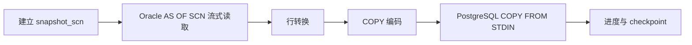

关键设计：

- 每个数据迁移任务必须生成 `DataSnapshotManifest`，至少包含 `snapshot_scn`、源库标识、源库版本、采集时间、表清单、shard 范围和校验策略。
- Oracle 直连数据读取在权限和 undo retention 允许时，必须使用同一个 `snapshot_scn`；无法使用一致性快照时，任务只能标记为高风险或非生产演示模式。
- Oracle 侧设置 fetch size。
- PostgreSQL 侧使用 CopyManager。
- 大表按主键 range 分片。
- 没有合适主键时使用 ROWID 或 hash 策略，具体视权限和版本决定。
- 每个 shard 独立 checkpoint。
- 失败 shard 可重试。
- 任务可暂停、取消、恢复。
- LOB 字段单独测试吞吐。
- 空字符串和 NULL 映射必须可配置。
- COPY 编码缓冲、LOB 中转缓冲、大文件解析缓冲先使用有界 heap / direct buffer；FFM 只有在压测证明收益后通过特性开关启用。

并发控制公式：

```text
activeShards <= min(
  oracleReadConnections,
  postgresCopyConnections,
  projectShardLimit,
  globalShardLimit
)
```

虚拟线程可以很多，但数据库连接和 COPY 通道不能无限。

### 19.1 FFM 堆外内存控制

FFM 不作为 P0 硬依赖。SchemaPilot 在 P1/P2 压测阶段使用 Java 25 Foreign Function & Memory API 控制大块临时内存，目标不是用 FFM 替代所有 Java 对象，而是把容易造成 GC 压力的大块迁移缓冲移到可控生命周期的堆外内存。

适合使用 FFM 的场景：

- PostgreSQL COPY 行编码缓冲。
- Oracle LOB 字段分块读取缓冲。
- 大 SQL 文件和 Data Pump SQLFILE 的分块解析缓冲。
- 大表 shard 的临时序列化缓冲。
- checksum 分片缓冲。

不适合使用 FFM 的场景：

- 项目、对象、风险、报告等普通业务实体。
- SQL AST 节点。
- 少量字符串转换。
- 需要长期保存的数据。

内存模型：

```text
GlobalMemoryBudget
  -> ProjectMemoryQuota
  -> TaskMemoryQuota
  -> ShardArena
  -> MemorySegment buffers
```

每个迁移 shard 使用独立 `Arena`。shard 完成、失败、取消时必须关闭 arena，释放所有关联堆外内存。

示意：

```java
try (Arena arena = Arena.ofConfined()) {
    MemorySegment buffer = arena.allocate(bufferSize, 8);
    // encode rows into buffer, flush to COPY when full
}
```

设计规则：

- 所有 FFM 分配必须经过 `MemoryBudgetManager`。
- 每个项目有堆外内存上限。
- 每个 task / shard 有堆外内存上限。
- 必须配置 hard watermark，默认建议为项目堆外预算的 80%。
- 达到 hard watermark 后，新 shard 分配必须暂停或失败，并生成告警/待处理项。
- arena 生命周期必须绑定 task / shard 生命周期。
- 禁止把 `MemorySegment` 泄露到 task 生命周期之外。
- PostgreSQL JDBC 边界如果需要 `byte[]`，允许在 flush 边界做小块复制，但不能让整批数据堆内驻留。
- 只有调用 native library、`jextract`、downcall 或受限方法时，才打开 `--enable-native-access`。

必须监控：

- 当前堆外分配总量。
- 每项目堆外内存使用。
- 每 shard 堆外内存使用。
- arena 未关闭数量。
- COPY flush 次数和平均 buffer 大小。
- 因内存预算触发的限流次数。
- hard watermark hit 次数。
- 暂停新 shard 的持续时间。

## 20. Java 25 虚拟线程策略

适合虚拟线程：

- HTTP 请求处理。
- JDBC metadata 查询。
- Oracle 数据读取。
- PostgreSQL COPY 写入。
- 文件读取。
- 报告 I/O。

不适合直接无限使用虚拟线程：

- AST 深度解析。
- checksum 计算。
- 大型报告渲染。
- 压缩和加密。

CPU 密集型任务使用固定线程池：

```java
Executors.newFixedThreadPool(Runtime.getRuntime().availableProcessors())
```

必须监控：

- 虚拟线程 pinning。
- Hikari 连接池等待时间。
- Oracle 查询等待。
- PostgreSQL COPY 写入速度。
- GC 和堆外内存。

避免：

- 在 `synchronized` 大块代码中做 JDBC I/O。
- 无限制 `newVirtualThreadPerTaskExecutor()` 提交迁移 shard。
- 把数据库连接池大小误认为迁移并发上限之外的东西。

连接池背压要求：

- 每个数据源必须有 datasource-level execution slot。
- execution slot 默认不超过连接池容量的安全比例，并可按任务类型区分扫描、DDL、COPY、校验。
- 虚拟线程提交任务前必须先获取 project/table/global slot，再获取 datasource slot，避免大量虚拟线程同时阻塞在连接池。
- 持有 JDBC connection 的代码段不得执行长时间 CPU 密集任务；FFM 编码、checksum、压缩、报告渲染应尽量在连接外完成或切小块。
- slot 等待超过阈值必须记录为执行瓶颈，不应只表现为请求超时。

## 21. 校验设计

校验等级：

| 等级 | 内容 |
|---|---|
| L1 | 对象是否存在 |
| L2 | 表行数 |
| L3 | 抽样数据 |
| L4 | 分片 checksum |
| L5 | 业务 SQL 回归 |

校验门禁按用途分级：

- P0 评估转换闭环只生成 Validation Plan 建议，不声明可切换生产。
- P1 结构执行至少完成对象存在、DDL dry-run、关键 view/routine/trigger smoke test、权限检查和 SQL 包一致性检查。
- P2 数据迁移至少完成全表 L1/L2；高风险表、核心业务表或抽样指定表必须完成 L3；大表和关键表在可承受成本下执行 L4。
- Cutover-ready 报告必须额外检查 sequence position、grant/owner、post-load analyze、剩余 waived 风险和回滚脚本。
- L5 业务 SQL 回归来自用户提供的验收 SQL，不由平台自动臆造业务正确性。

Validation Report 必须明确标识结论类型：`DEMO_ONLY`、`STRUCTURE_READY`、`DATA_READY`、`CUTOVER_READY` 或 `BLOCKED`。

## 22. 安全设计

- 数据库密码加密保存。
- API 不返回明文密码。
- 日志脱敏。
- AI 提示词和响应中不得出现明文密码、连接串、密钥。
- AI 输出不得未经审核直接执行。
- 上传 SQL 不允许未经审核直接执行。
- 文件存储按项目隔离。
- 执行动作必须审计。
- 支持只读扫描账号和执行账号分离。
- `SECURITY DEFINER` 函数和过程默认标记高风险，必须检查 owner、执行权限和 `search_path`。
- 自动生成的 PostgreSQL routine 如涉及 `SECURITY DEFINER`，必须显式设置安全 `search_path`，并把默认 `EXECUTE` 权限和 grant replay 放入审核项。
- 角色、owner、grant 映射必须进入 Migration Plan Report；缺失映射不能静默跳过。

## 23. 可观测性

必须展示：

- 扫描进度。
- 解析进度。
- 转换成功率。
- 风险数量。
- 审核状态。
- 每张表迁移进度。
- 每个 shard 进度。
- rows/s。
- COPY MB/s。
- 失败 SQL。
- 失败原因。
- 重试次数。
- AI 请求次数、耗时、失败率、token 或成本估算。
- AI 建议接受率。

## 24. 开源底座选型

SchemaPilot 后端明确使用 Java。MVP 要坚持 **Java-first**：核心链路不引入 Python sidecar，不把 Perl 工具深度嵌入 Java 进程，不依赖非 Java 服务才能跑通第一条闭环。

不建议直接 fork 某个大型数据库平台作为主干。更稳的方式是：

```text
自研迁移闭环主干
  + 成熟开源组件
  + 可替换适配层
  + 外部工具交叉校验
```

### 24.1 选型结论

| 层 | 推荐基础 | 使用方式 | 原因 |
|---|---|---|---|
| 前端管理台 | Ant Design / Ant Design Pro | 作为 UI 和页面模板基础 | 企业后台成熟，表单、表格、工作台效率高 |
| 后端主框架 | Spring Boot 4.x | 主应用框架 | 适合 Java 25、虚拟线程、JDBC、任务编排 |
| AI 能力 | Spring AI 优先，LangChain4j 备选 | `AiProvider` 适配层 | Spring AI 和 Spring Boot 结合自然；LangChain4j provider 更丰富 |
| Oracle 迁移参考 | Ora2Pg | 外部 CLI / 规则参考 / 报告交叉校验 | Oracle -> PostgreSQL 迁移经验成熟 |
| 普通 SQL 解析 | JSqlParser / Apache Calcite | Java 内嵌解析器 | Java 生态，适合 DDL、查询、表达式处理 |
| PL/SQL 解析 | ANTLR grammars-v4 PL/SQL grammar | 生成 parser 后二次封装 | 能识别 trigger/function/procedure/package |
| SQL 方言转换参考 | SQLGlot | P2 可选 sidecar，不进入 MVP 主链路 | Oracle/Postgres 方言转换强，但 Python 栈和 Java 主体不同 |
| 平台元数据库迁移 | Flyway | 管理 SchemaPilot 自己的表结构 | 简单稳定，Spring 集成好 |
| 高速数据写入 | pgJDBC CopyManager | 直接使用 | 控制力强，适合自研 checkpoint 和进度 |
| 堆外内存控制 | Java 25 FFM API | P1/P2 特性开关 | COPY、LOB、文件解析缓冲可控，但必须压测证明收益后启用 |
| CDC 增量同步 | Debezium Oracle Connector | P3 可选 | 适合后续在线同步，不进入 MVP |

### 24.2 为什么不直接 fork 一个大项目

不建议直接 fork：

- DBeaver / CloudBeaver：数据库客户端能力强，但产品形态偏通用数据库管理，不是 Oracle -> PostgreSQL 迁移评审平台。
- Bytebase：审批和数据库 DevOps 很强，但核心不是 Oracle 资产转换和 PL/SQL 迁移。
- Ora2Pg：迁移能力成熟，但它是 Perl CLI 工具，适合作为外部工具和规则参考，不适合作为 Java Web 平台主干。
- SeaTunnel：数据同步能力强，但对本项目第一阶段的“评估、转换、审核”闭环过重。

主干必须自己掌握：

- 统一资产模型。
- SQL 基线和报告版本。
- 审核门禁。
- AI 建议审计。
- 迁移计划状态机。
- 错误回流。

这些是 SchemaPilot 的产品核心，不能外包给通用工具。

### 24.3 Java-first 边界

MVP 主链路必须全部 Java 化：

```text
Spring Boot
  -> 自研 statement splitter
  -> JSqlParser / Calcite
  -> ANTLR PL/SQL parser
  -> Java 规则引擎
  -> Spring AI / LangChain4j adapter
  -> bounded heap/direct buffer
  -> Java FFM off-heap buffer（P1/P2 feature flag）
  -> pgJDBC CopyManager
```

MVP 不使用：

- Python sidecar 作为必需服务。
- Perl 模块作为 Java 内嵌依赖。
- GPL 工具深度链接进核心进程。
- 需要额外 worker 才能跑通的转换链路。

这样能保证开发、部署、测试、打包都简单，也符合 Java 25 + 虚拟线程的主架构。

### 24.4 Ora2Pg 的使用边界

Ora2Pg 适合用在三个地方：

- 作为评估报告的交叉校验来源。
- 作为 Oracle 对象转换规则参考。
- 作为可选外部 CLI，用户允许时运行并导入结果。

使用边界：

- 如果 SchemaPilot 未来是商业闭源产品，不能把 GPLv3 的 Ora2Pg 深度链接进核心代码。
- 可以通过外部进程调用、配置文件、输出文件导入来隔离。
- 平台自己的转换结果仍以 SchemaPilot 的规则引擎、用户编辑和审核基线为准。

### 24.5 SQL 解析组合

推荐组合：

```text
Statement Splitter：自研，专门处理 SQLPlus、/、PL/SQL 块
普通 SQL / DDL：JSqlParser 或 Calcite
PL/SQL：ANTLR grammar
复杂 SQL 转换参考：SQLGlot sidecar，P2 可选
```

原因：

- PL/SQL 切分和对象识别是平台核心，必须自研。
- 普通 SQL 可借助成熟 Java parser。
- PL/SQL 需要 grammar，但生成 AST 后仍要自建对象模型。
- SQLGlot 很强，但引入 Python sidecar 会增加部署复杂度，不放进 Java MVP 主链路。

### 24.6 AI 底座

第一选择：Spring AI。

原因：

- 和 Spring Boot 生态一致。
- 支持 ChatClient、Advisor、工具调用和结构化输出等常见模式。
- 适合我们做 `AiProvider`、上下文构建、审计、可观测性。

备选：LangChain4j。

适合场景：

- 需要更多 LLM provider。
- 需要更多 LLM provider 或更强的工具调用、agent 生态。
- Spring AI 在某些 provider 上不满足需求。

设计上必须保留 `AiProvider` 抽象，避免被单一 AI 框架锁死。

## 25. 第一条闭环边界

第一条可演示闭环必须做实：

- 手工 SQL 输入。
- 单个 SQL 文件上传。
- 多工程、文件夹和 zip 导入。
- 工程树、来源树和对象清单。
- 基础依赖和来源追溯。
- 表、字段、索引、sequence、简单 view 转换。
- trigger/function/procedure/package 识别和风险标注。
- 转换工作台。
- AI 风险解释和 SQL 改造建议。
- AI 预处理报告摘要。
- 预处理报告。
- 审核流程。
- SQL 包导出。

第一条闭环可以不做：

- 直连 Oracle 扫描。
- 完整数据迁移。
- 复杂 package 自动转换。
- `.dmp` 直接读取。
- 分布式 worker。
- 外部化 Agent / MCP / Skills。
- FFM 作为 P0 硬依赖。
- 在线 CDC。
- AI 自动执行 SQL。
- AI 自动审核通过。

这个边界更真实，也更容易快速做出可演示、可验收、可继续扩展的版本。
