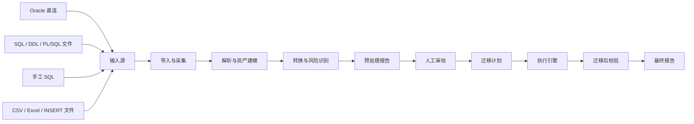
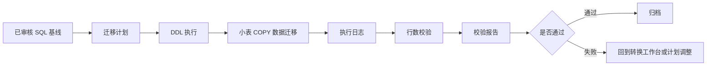
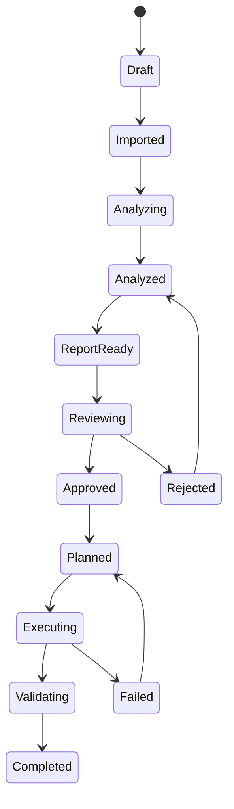
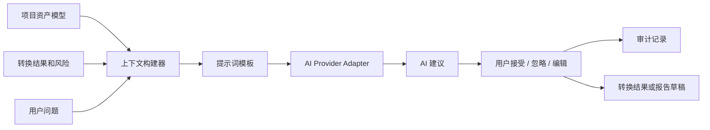
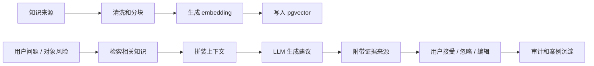
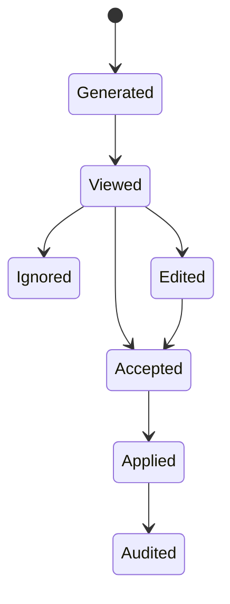
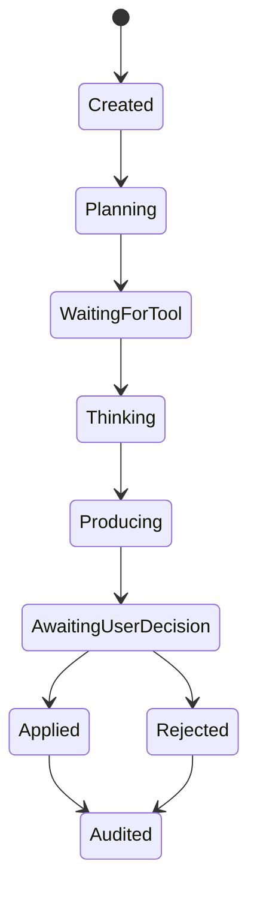
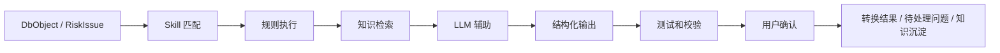
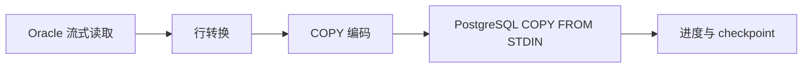

# SchemaPilot 设计文档

## 1. 设计结论

SchemaPilot 要做成 **Oracle 到 PostgreSQL 的可视化迁移评估、转换、审核、执行平台**，而不是一个简单的建表和导数工具。

关键设计决策：

- 后端采用 **Java 25 + Spring Boot 4.x + 虚拟线程**，适合大量 JDBC 和文件 I/O。
- 架构先做 **模块化单体**，模块边界清楚，后续再拆 worker。
- 所有输入统一进入 **资产模型**：直连 Oracle、SQL 文件、Data Pump SQLFILE、手工 SQL、数据文件。
- SQL/PLSQL 转换分成两类：**可确定转换** 和 **辅助转换草稿**。
- PL/SQL、package、复杂 trigger 不承诺 100% 自动正确，必须进入风险和审核闭环。
- 预处理报告是核心门禁：**未审核通过，不允许正式执行**。
- 数据迁移走 PostgreSQL `COPY FROM STDIN`，配合 Oracle 流式读取、大表分片、虚拟线程并发、连接池限流。
- 大数据迁移缓冲使用 **Java 25 FFM API** 控制堆外内存，避免大批量 COPY、LOB、文件解析把 Java heap 打爆。
- 用户手工编辑后的目标 SQL 是执行基线，平台保存版本、diff、审核记录。
- AI 定位为 **迁移副驾驶**：负责解释、建议、生成草稿、诊断错误，不直接绕过规则引擎和审核执行 SQL。
- 第一版优先做评估、转换、报告、审核；数据高速迁移作为第二个大闭环推进。

## 2. 产品定位

SchemaPilot 的价值不是说“我能自动迁完所有 Oracle”，而是：

> 把 Oracle 到 PostgreSQL 的迁移过程变得可见、可评估、可修改、可审核、可执行、可校验。

目标用户：

- DBA：关心对象完整性、性能、权限、执行窗口、回滚风险。
- 开发：关心 SQL、PL/SQL、视图、trigger、函数过程的改造成本。
- 架构师：关心兼容性风险、迁移策略、治理流程。
- 项目负责人：关心进度、报告、审核结论、风险清单。

### 2.1 闭环总览

平台必须形成五个闭环，每个闭环都有明确输入、处理动作、产物、门禁和下一步。

| 闭环 | 输入 | 平台动作 | 产物 | 门禁 | 下一步 |
|---|---|---|---|---|---|
| 资产闭环 | 直连 Oracle、SQL 文件、手工 SQL | 采集、切分、识别、建模 | 统一对象清单 | 对象可追溯到来源 | 转换和风险 |
| 转换闭环 | 对象清单、规则配置 | 规则转换、AI 建议、人工编辑 | 目标 SQL 基线 | 用户确认目标 SQL | 报告 |
| 评审闭环 | 风险、目标 SQL、依赖、统计 | 生成预处理报告、审核 | 已审核报告快照 | 审核通过或有条件通过 | 计划 |
| 执行闭环 | 已审核 SQL 基线、迁移计划 | 执行 DDL、迁移数据、重试 | 执行日志和任务状态 | 失败项清零或豁免 | 校验 |
| 校验闭环 | 源库、目标库、执行结果 | 行数、抽样、checksum、对象校验 | 校验报告 | 差异处理完成 | 最终归档和规则沉淀 |

闭环原则：

- 每一步都保存版本和审计记录。
- 每个产物都能追溯到输入来源。
- AI 建议必须进入“接受、忽略、编辑”的决策链。
- 审核通过的报告和 SQL 基线冻结后，才能进入正式执行。
- 执行失败和校验失败必须回流到转换工作台或迁移计划，而不是停在错误日志里。

## 3. 支持范围

### 3.1 输入来源

| 输入来源 | 第一版支持策略 |
|---|---|
| Oracle 直连 | 支持，采集元数据、对象 DDL、PL/SQL 源码 |
| `.sql` 文件 | 支持，解析 DDL、DML、PL/SQL 块 |
| Data Pump SQLFILE | 支持，用户先用 `impdp SQLFILE=xxx.sql` 导出 |
| 手工 SQL | 支持，走同一套解析和转换流程 |
| INSERT 脚本 | 支持识别，数据执行后置 |
| CSV/Excel | 第二阶段支持，用于数据导入 |
| `.dmp` 文件 | 第一版不直接解析，提供操作向导 |

### 3.2 数据库对象

| 对象 | 第一版目标 |
|---|---|
| Table | 自动转换 |
| Column | 自动映射，可编辑 |
| Primary Key / Unique / Check | 自动转换 |
| Foreign Key | 自动转换，执行时可延后 |
| Index | 普通索引自动转换，函数索引标风险 |
| Sequence | 自动转换 |
| View | 简单视图自动转换，复杂视图标风险 |
| Trigger | 生成 PostgreSQL trigger function 草稿 |
| Function | 简单函数生成 PL/pgSQL 草稿 |
| Procedure | 简单过程生成 PL/pgSQL 草稿 |
| Package | 拆解识别，生成改造建议，不承诺自动完整转换 |
| Synonym | 生成处理建议 |
| Grant | 可选转换 |
| Comment | 自动转换 |
| Partition | 评估和草稿转换，复杂分区标风险 |

## 4. 总体流程



### 4.1 P0 闭环：评估转换闭环

P0 不追求完成真实生产迁移，而是必须让一个对象从输入到审核导出完整走完。


P0 的闭环验收：

- 输入可以是手工 SQL 或 SQL 文件。
- 解析失败的片段不会丢失，必须形成 `ParseIssue`。
- 每个识别出的对象都能看到原始 SQL、目标 SQL、风险、AI 建议和人工编辑记录。
- 用户编辑后的目标 SQL 成为导出基线。
- 预处理报告能引用当前基线版本。
- 未审核通过不能导出正式 SQL 包。

### 4.2 P1 闭环：执行校验闭环

P1 才进入目标库执行。



P1 的闭环验收：

- 迁移计划只能从已审核基线生成。
- DDL 执行失败能定位到对象和 SQL。
- 数据迁移失败能定位到表、批次或 shard。
- 校验失败能形成差异项，并能回流为待处理问题。

### 4.3 P2 闭环：规则沉淀闭环

P2 开始把项目经验沉淀成平台能力。

```text
人工修正 SQL
  -> 审核通过
  -> 执行成功
  -> 校验通过
  -> AI 建议抽取通用模式
  -> 用户确认生成规则
  -> 规则进入规则库
  -> 后续项目自动应用
```

规则沉淀必须人工确认，不能由 AI 自动写入生效规则。

## 5. 状态机

### 5.1 项目状态



### 5.2 对象状态

```text
IMPORTED
  -> PARSED
  -> CONVERTED
  -> EDITED
  -> REVIEWED
  -> PLANNED
  -> EXECUTED
  -> VALIDATED
```

对象可以停在任意状态。比如 package 可以停在 `CONVERTED`，但标记为 `MANUAL_REQUIRED`，等待开发人工处理。

## 6. 技术架构

### 6.1 前端

- React
- TypeScript
- Vite
- Ant Design Pro
- Monaco Editor：SQL/PLSQL 编辑、diff、错误定位。
- React Flow：对象依赖图、迁移计划图。
- ECharts：资产统计、风险分布、迁移速度、校验结果。
- TanStack Query：服务端状态缓存。
- SSE 客户端：任务进度实时刷新。

### 6.2 后端

- Java 25
- Spring Boot 4.x
- Spring MVC
- Spring Security
- Spring Batch
- Java FFM API：`MemorySegment`、`Arena`、`MemoryLayout`，用于受控堆外缓冲。
- PostgreSQL JDBC
- Oracle JDBC Thin Driver
- PostgreSQL CopyManager
- Flyway 或 Liquibase
- ANTLR：PL/SQL 解析。
- JSqlParser 或 Apache Calcite：普通 SQL 解析。
- Redis 可选：分布式锁、任务进度、缓存。

推荐基础配置：

```yaml
spring:
  threads:
    virtual:
      enabled: true
  main:
    keep-alive: true
```

## 7. 后端模块

```text
backend
  project        项目管理
  datasource     数据源、连接测试、凭据管理
  ingest         直连、文件、手工 SQL 输入
  metadata       Oracle 资产扫描
  parser         SQL / PL/SQL 解析
  model          统一资产模型
  converter      转换引擎
  ai             AI 副驾驶、上下文构建、建议管理
  risk           风险识别与评分
  report         预处理报告、最终报告
  review         审核流程
  planner        迁移计划生成
  executor       DDL 和数据执行
  validator      迁移后校验
  realtime       SSE 进度推送
  security       认证、权限、密钥保护
  audit          审计日志
```

## 8. 统一资产模型

所有来源都转成统一模型，避免“直连一套逻辑、文件一套逻辑、手工输入一套逻辑”。

核心实体：

```text
Project
DatasourceConfig
InputSource
DbObject
DbColumn
DbConstraint
DbIndex
DbTrigger
DbRoutine
DbPackage
DbView
DbSequence
ObjectDependency
ParseIssue
RiskIssue
ConversionResult
AiSuggestion
AiConversation
PromptTemplate
PrecheckReport
ReviewRecord
MigrationPlan
MigrationTask
ValidationReport
AuditLog
```

### 8.1 核心产物链路

闭环是否成立，关键看产物是否能串起来。

```text
InputSource
  -> DbObject
  -> ParseIssue / RiskIssue
  -> ConversionResult
  -> AiSuggestion
  -> EditedSqlVersion
  -> PrecheckReport
  -> ReviewRecord
  -> MigrationPlan
  -> MigrationTask
  -> ValidationReport
  -> FinalArchive
```

每个产物必须至少记录：

- `project_id`：归属项目。
- `source_id` 或 `object_id`：来源。
- `version`：版本。
- `status`：状态。
- `created_by` / `created_at`：审计。
- `input_hash`：用于判断报告或建议是否过期。

### 8.2 SQL 基线模型

执行不能直接使用“最新生成 SQL”，必须使用审核冻结后的 SQL 基线。

```text
generated_sql：规则引擎生成结果
ai_suggested_sql：AI 建议结果
edited_sql：用户编辑结果
baseline_sql：审核冻结结果，执行和导出只能使用它
```

基线规则：

- 用户未编辑时，`baseline_sql` 可以来自 `generated_sql`。
- 用户接受 AI 建议后，必须先形成 `edited_sql`，再进入审核。
- 审核通过后生成 `baseline_sql`。
- 任何对象、规则、目标 SQL 修改后，关联报告和计划必须标记为过期。

`DbObject` 必须保存：

- 原始来源。
- 原始 SQL。
- 规范化模型 JSON。
- 解析状态。
- 转换状态。
- 风险等级。
- 源码位置，文件输入时记录行号范围。

## 9. Oracle 采集设计

Oracle 直连采集分两条线：

- 字典视图采集结构化元数据。
- `DBMS_METADATA` / 源码视图采集原始 DDL 和 PL/SQL 源码。

采集策略：

- 按 schema 扫描。
- 按对象类型并行扫描。
- 支持只扫描部分对象。
- 支持重新扫描并生成差异。
- 采集结果落库，避免每次打开页面都查 Oracle。
- 权限不足时不要失败整个项目，只记录权限风险。

需要特别处理：

- 大小写和引号标识符。
- NLS 字符集。
- `DATE` 的时间语义。
- `NUMBER` 精度。
- LOB 字段。
- 分区表。
- 物化视图。
- 私有/公共同义词。

## 10. 文件和手工 SQL 解析设计

SQL 解析不能只靠 `;` 分割，因为 PL/SQL 内部也有分号。

解析流水线：

```text
原始文本
  -> 预处理，去除不可见字符、识别编码
  -> 语句切分，识别 CREATE PACKAGE / TRIGGER / PROCEDURE 块
  -> 对象分类
  -> SQL AST 解析
  -> PL/SQL AST 或容错解析
  -> 风险提取
  -> 统一资产模型
```

解析失败策略：

- 保留原始 SQL。
- 记录失败位置。
- 生成 `ParseIssue`。
- 允许用户手工指定对象类型。
- 允许进入转换工作台做人工处理。

这点很重要：**解析失败不等于流程失败**。

## 11. 转换引擎

转换引擎分层：

```text
ObjectConverter
  DdlConverter
  ViewConverter
  IndexConverter
  TriggerConverter
  RoutineConverter
  PackageAnalyzer

ExpressionRewriter
  FunctionMappingRule
  TypeMappingRule
  IdentifierRule
  DateTimeRule
  PaginationRule
  SequenceRule

Renderer
  PostgreSqlDdlRenderer
  PlpgsqlDraftRenderer
```

转换结果分级：

| 等级 | 含义 |
|---|---|
| AUTO | 可直接执行，但仍需审核 |
| REVIEW_REQUIRED | 能生成结果，但需要人工确认 |
| DRAFT | 只生成草稿，不建议直接执行 |
| MANUAL_REQUIRED | 必须人工改造 |
| UNSUPPORTED | 暂不支持 |

常见映射：

| Oracle | PostgreSQL |
|---|---|
| `VARCHAR2(n)` | `varchar(n)` |
| `NVARCHAR2(n)` | `varchar(n)` |
| `NUMBER(10,0)` | `integer` |
| `NUMBER(19,0)` | `bigint` |
| `NUMBER(p,s)` | `numeric(p,s)` |
| `NUMBER` | `numeric`，标记精度风险 |
| `DATE` | `timestamp`，标记语义风险 |
| `TIMESTAMP` | `timestamp` |
| `CLOB` | `text` |
| `BLOB` | `bytea` |
| `RAW` | `bytea` |
| `NVL(a,b)` | `COALESCE(a,b)` |
| `SYSDATE` | `CURRENT_TIMESTAMP` |
| `sequence.NEXTVAL` | `nextval('sequence')` |

## 12. PL/SQL 策略

PL/SQL 是最大风险点，必须诚实设计。

### 12.1 Trigger

Oracle trigger：

```sql
CREATE OR REPLACE TRIGGER trg
BEFORE INSERT ON t
FOR EACH ROW
BEGIN
  :NEW.created_at := SYSDATE;
END;
/
```

PostgreSQL 需要拆成：

```text
CREATE FUNCTION trg_fn() RETURNS trigger ...
CREATE TRIGGER trg BEFORE INSERT ON t FOR EACH ROW EXECUTE FUNCTION trg_fn();
```

第一版支持简单 `:NEW`、`:OLD`、`BEFORE/AFTER INSERT/UPDATE/DELETE`。

复杂 trigger 标风险：

- compound trigger。
- statement-level + row-level 混合。
- autonomous transaction。
- 调用 package 全局状态。

### 12.2 Function / Procedure

第一版支持：

- 参数识别。
- 返回值识别。
- 简单变量声明。
- 简单 SQL 语句。
- 常见函数替换。

标风险：

- 游标复杂循环。
- 动态 SQL。
- 异常处理语义差异。
- bulk collect / forall。
- Oracle 内置包。

### 12.3 Package

package 不当成“自动转换对象”，而当成“改造单元”。

处理方式：

- 解析 package spec 和 body。
- 提取函数、过程、类型、常量、变量。
- 生成拆解建议。
- 对可独立转换的 routine 生成草稿。
- 对全局状态、初始化逻辑、重载函数标风险。

## 13. 风险评估

风险等级：

- `LOW`：自动转换概率高。
- `MEDIUM`：需要确认。
- `HIGH`：需要人工改造。
- `BLOCKER`：阻塞执行。

风险类型：

- 语法风险。
- 类型风险。
- 语义风险。
- 性能风险。
- 权限风险。
- 执行顺序风险。
- 数据一致性风险。

典型风险：

- `NUMBER` 无精度。
- Oracle 空字符串等价 NULL。
- `DATE` 包含时间。
- `ROWNUM`。
- `CONNECT BY`。
- `DECODE`。
- 老式外连接 `(+)`。
- Oracle hint。
- 分区表。
- 函数索引。
- materialized view。
- package 全局变量。
- autonomous transaction。

## 14. AI 副驾驶设计

AI 不是迁移执行器，而是迁移副驾驶。平台必须保留确定性规则引擎作为主路径，AI 输出只能作为建议、草稿、解释或诊断，必须经过用户确认和审核。

AI 的闭环不是“问一下模型”，而是：

```text
构建上下文
  -> 调用模型
  -> 生成建议
  -> 用户接受 / 忽略 / 编辑
  -> 写入审计
  -> 影响转换草稿或报告摘要
  -> 重新生成报告或标记报告过期
```

AI 建议只有被用户接受或编辑后，才可能影响后续产物。

### 14.1 AI 能力范围

第一版适合做：

- 解释风险：把 `NUMBER`、`DATE`、`ROWNUM`、package 全局变量等风险翻译成人能看懂的影响和处理建议。
- SQL 改造建议：对单条 SQL、view、trigger、function/procedure 给出 PostgreSQL 改造思路。
- PL/SQL 草稿增强：在规则引擎草稿基础上补充说明和 TODO。
- 报告摘要：为预处理报告生成管理层摘要、DBA 摘要、开发改造清单摘要。
- 错误解释：解释解析失败、转换失败、执行失败的可能原因。
- 规则建议：根据用户确认过的改造方式，建议是否沉淀为转换规则。

后续增强：

- 结合对象依赖图做迁移顺序解释。
- 根据执行日志诊断失败 SQL。
- 根据校验差异生成排查建议。
- 根据历史项目推荐规则模板。
- 支持自然语言问答，例如“哪些对象阻塞上线？”、“哪些 package 最危险？”。

### 14.2 AI 不允许直接做的事

- 不允许未经审核直接执行 AI 生成的 SQL。
- 不允许把 AI 输出自动覆盖用户编辑后的执行基线。
- 不允许把数据库密码、连接串、密钥放入提示词。
- 不允许在没有引用原始对象和风险证据时给出“已完全兼容”的结论。
- 不允许 AI 决定审核通过。

### 14.3 AI 架构



核心模块：

```text
AiProvider
  OpenAIProvider
  LocalModelProvider
  MockProvider

AiContextBuilder
  ObjectContextBuilder
  ReportContextBuilder
  ErrorContextBuilder

AiSuggestionService
  explainRisk()
  suggestConversion()
  summarizeReport()
  diagnoseError()
  proposeRule()
```

### 14.4 上下文构建

AI 输入必须小而准，不能把整个数据库对象一股脑塞给模型。

上下文包建议包含：

- 对象类型、对象名、schema。
- 原始 Oracle SQL。
- 规则引擎生成的 PostgreSQL SQL。
- 风险清单。
- 依赖对象摘要。
- 用户已编辑内容。
- 目标 PostgreSQL 版本。
- 项目规则配置。

对大对象采用：

- 分块摘要。
- 只传相关片段。
- 先由规则引擎定位风险行，再让 AI 解释。
- 保存 AI 请求和响应的哈希、模型名、提示词版本。

### 14.5 RAG 和知识库

AI 回答应优先基于平台自己的知识：

- 内置 Oracle -> PostgreSQL 迁移规则。
- 项目转换规则。
- 已审核通过的历史改造案例。
- 官方文档摘录或人工维护知识库。
- 当前项目对象模型和风险结果。

第一版可以先做轻量级上下文拼装，同时把知识库表结构和索引接口预留出来。真正的向量检索建议从 P1 开始启用。

### 14.5.1 向量知识库设计

SchemaPilot 的知识库分四类：

| 知识库 | 内容 | 来源 | 用途 |
|---|---|---|---|
| 规则知识库 | 类型映射、函数映射、语法差异、风险解释 | 平台内置、人工维护 | 解释风险、生成建议 |
| 案例知识库 | 已审核 SQL 改造、PL/SQL 改造案例、失败修复案例 | 项目沉淀 | 推荐相似改造方式 |
| 文档知识库 | Oracle/PostgreSQL 官方文档摘录、内部规范、操作手册 | 人工导入 | 回答迁移问题，提供出处 |
| 项目知识库 | 当前项目对象摘要、风险摘要、报告摘要 | 自动生成 | 项目级问答和报告摘要 |

第一版推荐使用：

```text
PostgreSQL metadata DB
  + pgvector extension
  + Spring AI PgVectorStore
```

原因：

- 平台已经依赖 PostgreSQL，部署简单。
- pgvector 支持向量相似度搜索和 HNSW/IVFFlat 索引。
- Spring AI 已提供 PgVector VectorStore，可在 Java/Spring Boot 中直接使用。
- 元数据、知识 chunk、向量、审计记录可以放在同一个数据库事务体系里。

后续如果知识量和并发量明显变大，再抽象到 Milvus、Qdrant 或 Elasticsearch/OpenSearch 混合检索。

### 14.5.2 RAG 闭环



RAG 回答必须包含：

- 使用了哪些知识片段。
- 片段来源。
- 片段版本。
- 相似度分数。
- 生成建议。
- 是否被用户采纳。

### 14.5.3 知识入库策略

知识 chunk 建议结构：

```text
knowledge_document
  id
  source_type
  title
  source_uri
  version
  owner
  status

knowledge_chunk
  id
  document_id
  chunk_type
  content
  metadata
  content_hash
  embedding
```

chunk 类型：

- `RULE`：迁移规则。
- `CASE`：历史改造案例。
- `DOC`：官方或内部文档。
- `ERROR_FIX`：错误修复经验。
- `PROJECT_SUMMARY`：项目级摘要。

metadata 至少包含：

- Oracle 版本。
- PostgreSQL 版本。
- 对象类型。
- 风险类型。
- 规则版本。
- 项目 ID，历史案例需要区分是否允许跨项目复用。

### 14.5.4 检索策略

推荐混合检索：

```text
metadata filter
  + keyword search
  + vector similarity search
  + rerank
```

例子：

- 用户问 `ROWNUM 怎么迁移`：先按 `risk_type = ROWNUM` 过滤，再向量检索相关规则和案例。
- 用户查看某个 trigger：先按 `object_type = TRIGGER` 过滤，再检索相似 trigger 改造案例。
- 生成报告摘要：先检索当前项目的风险摘要、阻塞项、历史同类项目建议。

第一版可以先做：

- metadata filter。
- pgvector topK 检索。
- 简单分数阈值。

后续再加：

- BM25/全文检索。
- reranker。
- 多路召回。
- 反馈学习。

### 14.5.5 安全和隔离

- 默认不把项目 SQL 和对象摘要跨项目复用。
- 历史案例进入全局知识库前必须脱敏和审核。
- 数据库连接串、密码、IP、业务敏感字段不得进入 embedding。
- AI 回答必须标明“基于检索知识建议”，不能说成确定事实。
- 企业私有化部署时支持关闭外部 embedding provider，改用本地 embedding 模型。

### 14.6 数据模型

建议新增：

```text
ai_provider_config
  provider_type
  endpoint
  model_name
  encrypted_api_key
  enabled

prompt_template
  code
  version
  purpose
  template_text

ai_suggestion
  project_id
  object_id
  suggestion_type
  prompt_version
  model_name
  input_hash
  output_text
  status
  accepted_by
  accepted_at

ai_conversation
  project_id
  object_id
  title
  created_by

ai_message
  conversation_id
  role
  content
  created_at
```

### 14.7 审计和安全

- AI 请求前必须脱敏连接串、密码、密钥。
- AI 建议必须保存版本。
- 用户接受 AI 建议必须记录审计日志。
- AI 输出进入转换结果前必须经过人工确认。
- 支持关闭云端 AI，仅使用本地模型或完全关闭 AI。
- 对企业场景预留私有模型网关。

### 14.8 AI 建议状态机



状态含义：

- `Generated`：模型已生成，尚未被用户查看。
- `Viewed`：用户已查看。
- `Accepted`：用户接受原建议。
- `Ignored`：用户忽略建议。
- `Edited`：用户基于建议进行了修改。
- `Applied`：建议影响了目标 SQL、报告摘要或处理建议。
- `Audited`：审计日志已记录。

### 14.9 UI 形态

适合放在这些位置：

- 转换工作台右侧：`解释风险`、`优化转换`、`生成改造说明`。
- 预处理报告页：`生成摘要`、`生成开发改造清单`。
- 执行监控页：`解释失败原因`、`建议重试策略`。
- 对象清单页：`询问此对象`。
- 项目 dashboard：`问 AI`，用于基于当前项目资产问答。

## 15. Agent、MCP 和 Skills 设计

SchemaPilot 可以引入 Agent、MCP 和 Skills，但它们必须服务于迁移闭环，不能绕过规则、审核和 SQL 基线。

三者分工：

| 层 | 定位 | 例子 | 产物 |
|---|---|---|---|
| Agent | 有状态的任务编排者 | 评估 Agent、转换 Agent、校验 Agent | `WorkItem`、`AiSuggestion`、`ConversionResult` |
| MCP | 工具和上下文协议层 | 暴露对象、报告、工具；调用外部文档、工单、代码仓库 | 工具调用记录、资源快照 |
| Skill | 可复用迁移能力包 | `oracle-trigger-to-pg`、`rownum-rewrite`、`package-analyzer` | 规则、提示词、测试、输出 schema |

原则：

- Agent 只能在授权范围内调用工具。
- MCP 工具必须 allowlist、限时、限参、审计。
- Skill 必须版本化，有适用条件和测试样例。
- Agent 和 Skill 产生的是建议、草稿或任务，不能直接替代审核。
- 任何影响执行 SQL 的结果都必须进入 SQL 版本和报告审核链路。

### 15.1 Agent 分层

MVP 不做完全自主的多 Agent 系统，先做窄职责 Agent。

推荐 Agent：

| Agent | 职责 | 可调用能力 | 禁止事项 |
|---|---|---|---|
| AssessmentAgent | 汇总对象、风险、兼容性 | 对象查询、风险规则、知识库检索 | 不修改 SQL |
| ConversionAgent | 对单个对象生成转换建议 | 转换规则、Skill、知识库、LLM | 不冻结基线 |
| ReviewAgent | 生成审核摘要和待确认项 | 报告、风险、diff、知识库 | 不决定审核通过 |
| ExecutionPlannerAgent | 生成迁移计划建议 | 依赖图、基线 SQL、执行模式 | 不直接执行 |
| ErrorDiagnosisAgent | 解释解析、转换、执行、校验错误 | 日志、对象、知识库、历史案例 | 不自动重试生产任务 |
| KnowledgeAgent | 维护知识入库和检索 | 文档、案例、规则、embedding | 不跨项目泄露敏感案例 |

Agent 输出统一落库：

```text
agent_run
  id
  project_id
  agent_type
  trigger_type
  input_ref
  status
  started_at
  finished_at

agent_step
  run_id
  step_type
  tool_name
  input_hash
  output_ref
  status

work_item
  project_id
  object_id
  source
  title
  severity
  status
  suggested_action
```

Agent 状态机：



### 15.2 MCP 设计

SchemaPilot 同时可以是 MCP Server 和 MCP Client。

作为 MCP Server，向内部 Agent 或外部受信客户端暴露：

- Resources：项目、对象、风险、报告、知识 chunk、执行日志。
- Tools：解析 SQL、转换对象、检索知识、生成报告摘要、诊断错误。
- Prompts：风险解释、PL/SQL 改造、报告摘要、错误诊断等模板。

作为 MCP Client，可选连接：

- 内部文档知识库。
- 工单系统。
- Git 仓库。
- 企业模型网关。
- 受信的外部迁移工具。

MCP 暴露示例：

```text
Resources
  schemapilot://projects/{projectId}/objects/{objectId}
  schemapilot://projects/{projectId}/reports/precheck/{reportId}
  schemapilot://projects/{projectId}/knowledge/chunks/{chunkId}

Tools
  scanProjectObjects(projectId)
  parseOracleSql(inputSourceId)
  convertObject(objectId, skillCode)
  explainRisk(riskIssueId)
  searchKnowledge(query, filters)
  generatePrecheckSummary(reportId)
  diagnoseExecutionError(taskStepId)

Prompts
  oracle-risk-explanation
  plsql-to-plpgsql-draft
  precheck-executive-summary
  migration-error-diagnosis
```

安全要求：

- 默认只启用内部 MCP Server。
- 外部 MCP Client 功能默认关闭。
- 所有 MCP tools 必须配置 allowlist。
- 生产环境优先使用 HTTP/SSE 或 Streamable HTTP；STDIO 只用于本地开发和受信工具。
- 工具参数必须 JSON Schema 校验。
- 工具调用必须有超时、重试上限和审计日志。
- 写操作工具默认 dry-run，正式写入必须走审核门禁。
- MCP 返回内容必须脱敏。

### 15.3 Skills 设计

Skill 是可复用迁移能力包，不是纯 prompt。

一个 Skill 包含：

```text
skill.yaml
rules/
prompts/
knowledge-filters/
tools/
fixtures/
tests/
docs/
```

`skill.yaml` 示例：

```yaml
code: oracle-trigger-to-postgres
version: 1.0.0
objectTypes:
  - TRIGGER
riskTypes:
  - TRIGGER_BODY
inputs:
  - originalSql
  - objectMetadata
  - dependencySummary
outputs:
  schema: TriggerConversionResult
allowedTools:
  - searchKnowledge
  - renderPostgresSql
requiresReview: true
```

第一批内置 Skills：

| Skill | 用途 |
|---|---|
| `oracle-table-ddl` | 表、字段、约束转换 |
| `oracle-index-sequence` | 索引和 sequence 转换 |
| `oracle-view-sql` | view SQL 转换和风险识别 |
| `oracle-trigger-to-postgres` | trigger function 草稿 |
| `plsql-procedure-draft` | procedure/function 草稿 |
| `oracle-package-analyzer` | package 拆解和风险分析 |
| `rownum-pagination-rewrite` | ROWNUM 改写 |
| `connect-by-analysis` | 层级查询风险和改写建议 |
| `data-copy-tuning` | COPY 参数和分片建议 |
| `validation-diagnosis` | 校验差异诊断 |

Skill 执行流程：



Skill 上线门禁：

- 必须有 fixture。
- 必须有输出 schema。
- 必须声明允许调用的 MCP tools。
- 必须声明是否需要审核。
- 必须有版本号和 changelog。
- 高风险 Skill 默认只能生成草稿。

### 15.4 Java 实现建议

Java-first 实现：

```text
AgentRuntime：自研轻量状态机
SkillRegistry：扫描内置和插件 Skill
ToolRegistry：统一 MCP tool 和本地 tool
McpGateway：Spring AI MCP Client/Server 适配
SkillExecutor：规则 + RAG + LLM + schema validation
AgentAuditService：记录 agent/tool/skill 全链路
```

不建议 MVP 使用复杂的自主 Agent 框架。先用确定性状态机和任务表，把 Agent 做成可暂停、可重试、可审计的后台任务。

## 16. 预处理报告

预处理报告不是附属功能，是平台核心。

报告内容：

- 项目摘要。
- 输入来源摘要。
- 对象统计。
- 数据量估算。
- 大表清单。
- 兼容性评分。
- 风险分布。
- 高风险对象清单。
- 类型映射清单。
- SQL/PLSQL 问题清单。
- 对象依赖图。
- 建议迁移顺序。
- 建议执行模式。
- 建议并发参数。
- 阻塞项。
- 审核结论。

报告是快照。报告生成后，如果对象、规则或目标 SQL 被修改，报告需要重新生成或标记为过期。

AI 可参与生成报告摘要和建议处理方式，但报告结论仍来自规则引擎、风险评估和人工审核。

## 17. 审核门禁

正式执行必须满足：

- 预处理报告已生成。
- 阻塞项已处理或被有权限用户豁免。
- 必要角色审核通过。
- 执行 SQL 基线已冻结。
- 迁移计划已生成。

审核记录必须包含：

- 审核人。
- 审核时间。
- 审核结论。
- 审核意见。
- 报告版本。
- 转换结果版本。

## 18. 迁移计划

迁移计划从审核通过的转换结果生成。

执行阶段：

```text
PREPARE_TARGET
  -> CREATE_SCHEMA
  -> CREATE_TABLE
  -> LOAD_DATA
  -> CREATE_INDEX
  -> CREATE_CONSTRAINT
  -> CREATE_VIEW
  -> CREATE_ROUTINE
  -> CREATE_TRIGGER
  -> VALIDATE
```

模式：

- 预演模式：只生成计划和 SQL，不执行。
- 结构模式：只执行 DDL。
- 数据模式：只迁移数据。
- 极速模式：先表、后数据、再索引约束。
- 稳定模式：降低并发，保守执行。
- 校验模式：执行更强的数据校验。

## 19. 数据迁移引擎

数据迁移必须围绕速度和可恢复设计。



关键设计：

- Oracle 侧设置 fetch size。
- PostgreSQL 侧使用 CopyManager。
- 大表按主键 range 分片。
- 没有合适主键时使用 ROWID 或 hash 策略，具体视权限和版本决定。
- 每个 shard 独立 checkpoint。
- 失败 shard 可重试。
- 任务可暂停、取消、恢复。
- LOB 字段单独测试吞吐。
- 空字符串和 NULL 映射必须可配置。
- COPY 编码缓冲、LOB 中转缓冲、大文件解析缓冲优先使用 FFM 堆外内存。

并发控制公式：

```text
activeShards <= min(
  oracleReadConnections,
  postgresCopyConnections,
  projectShardLimit,
  globalShardLimit
)
```

虚拟线程可以很多，但数据库连接和 COPY 通道不能无限。

### 18.1 FFM 堆外内存控制

SchemaPilot 使用 Java 25 的 Foreign Function & Memory API 控制大块临时内存。目标不是用 FFM 替代所有 Java 对象，而是把容易造成 GC 压力的大块迁移缓冲移到可控生命周期的堆外内存。

适合使用 FFM 的场景：

- PostgreSQL COPY 行编码缓冲。
- Oracle LOB 字段分块读取缓冲。
- 大 SQL 文件和 Data Pump SQLFILE 的分块解析缓冲。
- 大表 shard 的临时序列化缓冲。
- checksum 分片缓冲。

不适合使用 FFM 的场景：

- 项目、对象、风险、报告等普通业务实体。
- SQL AST 节点。
- 少量字符串转换。
- 需要长期保存的数据。

内存模型：

```text
GlobalMemoryBudget
  -> ProjectMemoryQuota
  -> TaskMemoryQuota
  -> ShardArena
  -> MemorySegment buffers
```

每个迁移 shard 使用独立 `Arena`。shard 完成、失败、取消时必须关闭 arena，释放所有关联堆外内存。

示意：

```java
try (Arena arena = Arena.ofConfined()) {
    MemorySegment buffer = arena.allocate(bufferSize, 8);
    // encode rows into buffer, flush to COPY when full
}
```

设计规则：

- 所有 FFM 分配必须经过 `MemoryBudgetManager`。
- 每个项目有堆外内存上限。
- 每个 task / shard 有堆外内存上限。
- arena 生命周期必须绑定 task / shard 生命周期。
- 禁止把 `MemorySegment` 泄露到 task 生命周期之外。
- PostgreSQL JDBC 边界如果需要 `byte[]`，允许在 flush 边界做小块复制，但不能让整批数据堆内驻留。
- 只有调用 native library、`jextract`、downcall 或受限方法时，才打开 `--enable-native-access`。

必须监控：

- 当前堆外分配总量。
- 每项目堆外内存使用。
- 每 shard 堆外内存使用。
- arena 未关闭数量。
- COPY flush 次数和平均 buffer 大小。
- 因内存预算触发的限流次数。

## 20. Java 25 虚拟线程策略

适合虚拟线程：

- HTTP 请求处理。
- JDBC metadata 查询。
- Oracle 数据读取。
- PostgreSQL COPY 写入。
- 文件读取。
- 报告 I/O。

不适合直接无限使用虚拟线程：

- AST 深度解析。
- checksum 计算。
- 大型报告渲染。
- 压缩和加密。

CPU 密集型任务使用固定线程池：

```java
Executors.newFixedThreadPool(Runtime.getRuntime().availableProcessors())
```

必须监控：

- 虚拟线程 pinning。
- Hikari 连接池等待时间。
- Oracle 查询等待。
- PostgreSQL COPY 写入速度。
- GC 和堆外内存。

避免：

- 在 `synchronized` 大块代码中做 JDBC I/O。
- 无限制 `newVirtualThreadPerTaskExecutor()` 提交迁移 shard。
- 把数据库连接池大小误认为迁移并发上限之外的东西。

## 21. 校验设计

校验等级：

| 等级 | 内容 |
|---|---|
| L1 | 对象是否存在 |
| L2 | 表行数 |
| L3 | 抽样数据 |
| L4 | 分片 checksum |
| L5 | 业务 SQL 回归 |

第一版做到 L1-L2，第二阶段做到 L3-L4。

## 22. 安全设计

- 数据库密码加密保存。
- API 不返回明文密码。
- 日志脱敏。
- AI 提示词和响应中不得出现明文密码、连接串、密钥。
- AI 输出不得未经审核直接执行。
- 上传 SQL 不允许未经审核直接执行。
- 文件存储按项目隔离。
- 执行动作必须审计。
- 支持只读扫描账号和执行账号分离。

## 23. 可观测性

必须展示：

- 扫描进度。
- 解析进度。
- 转换成功率。
- 风险数量。
- 审核状态。
- 每张表迁移进度。
- 每个 shard 进度。
- rows/s。
- COPY MB/s。
- 失败 SQL。
- 失败原因。
- 重试次数。
- AI 请求次数、耗时、失败率、token 或成本估算。
- AI 建议接受率。

## 24. 开源底座选型

SchemaPilot 后端明确使用 Java。MVP 要坚持 **Java-first**：核心链路不引入 Python sidecar，不把 Perl 工具深度嵌入 Java 进程，不依赖非 Java 服务才能跑通第一条闭环。

不建议直接 fork 某个大型数据库平台作为主干。更稳的方式是：

```text
自研迁移闭环主干
  + 成熟开源组件
  + 可替换适配层
  + 外部工具交叉校验
```

### 23.1 选型结论

| 层 | 推荐基础 | 使用方式 | 原因 |
|---|---|---|---|
| 前端管理台 | Ant Design / Ant Design Pro | 作为 UI 和页面模板基础 | 企业后台成熟，表单、表格、工作台效率高 |
| 后端主框架 | Spring Boot 4.x | 主应用框架 | 适合 Java 25、虚拟线程、JDBC、任务编排 |
| AI 能力 | Spring AI 优先，LangChain4j 备选 | `AiProvider` 适配层 | Spring AI 和 Spring Boot 结合自然；LangChain4j provider 更丰富 |
| Oracle 迁移参考 | Ora2Pg | 外部 CLI / 规则参考 / 报告交叉校验 | Oracle -> PostgreSQL 迁移经验成熟 |
| 普通 SQL 解析 | JSqlParser / Apache Calcite | Java 内嵌解析器 | Java 生态，适合 DDL、查询、表达式处理 |
| PL/SQL 解析 | ANTLR grammars-v4 PL/SQL grammar | 生成 parser 后二次封装 | 能识别 trigger/function/procedure/package |
| SQL 方言转换参考 | SQLGlot | P2 可选 sidecar，不进入 MVP 主链路 | Oracle/Postgres 方言转换强，但 Python 栈和 Java 主体不同 |
| 平台元数据库迁移 | Flyway | 管理 SchemaPilot 自己的表结构 | 简单稳定，Spring 集成好 |
| 高速数据写入 | pgJDBC CopyManager | 直接使用 | 控制力强，适合自研 checkpoint 和进度 |
| 堆外内存控制 | Java 25 FFM API | 直接使用 | COPY、LOB、文件解析缓冲可控，降低 GC 压力 |
| CDC 增量同步 | Debezium Oracle Connector | P3 可选 | 适合后续在线同步，不进入 MVP |

### 23.2 为什么不直接 fork 一个大项目

不建议直接 fork：

- DBeaver / CloudBeaver：数据库客户端能力强，但产品形态偏通用数据库管理，不是 Oracle -> PostgreSQL 迁移评审平台。
- Bytebase：审批和数据库 DevOps 很强，但核心不是 Oracle 资产转换和 PL/SQL 迁移。
- Ora2Pg：迁移能力成熟，但它是 Perl CLI 工具，适合作为外部工具和规则参考，不适合作为 Java Web 平台主干。
- SeaTunnel：数据同步能力强，但对本项目第一阶段的“评估、转换、审核”闭环过重。

主干必须自己掌握：

- 统一资产模型。
- SQL 基线和报告版本。
- 审核门禁。
- AI 建议审计。
- 迁移计划状态机。
- 错误回流。

这些是 SchemaPilot 的产品核心，不能外包给通用工具。

### 23.3 Java-first 边界

MVP 主链路必须全部 Java 化：

```text
Spring Boot
  -> 自研 statement splitter
  -> JSqlParser / Calcite
  -> ANTLR PL/SQL parser
  -> Java 规则引擎
  -> Spring AI / LangChain4j adapter
  -> Java FFM off-heap buffer
  -> pgJDBC CopyManager
```

MVP 不使用：

- Python sidecar 作为必需服务。
- Perl 模块作为 Java 内嵌依赖。
- GPL 工具深度链接进核心进程。
- 需要额外 worker 才能跑通的转换链路。

这样能保证开发、部署、测试、打包都简单，也符合 Java 25 + 虚拟线程的主架构。

### 23.4 Ora2Pg 的使用边界

Ora2Pg 适合用在三个地方：

- 作为评估报告的交叉校验来源。
- 作为 Oracle 对象转换规则参考。
- 作为可选外部 CLI，用户允许时运行并导入结果。

使用边界：

- 如果 SchemaPilot 未来是商业闭源产品，不能把 GPLv3 的 Ora2Pg 深度链接进核心代码。
- 可以通过外部进程调用、配置文件、输出文件导入来隔离。
- 平台自己的转换结果仍以 SchemaPilot 的规则引擎、用户编辑和审核基线为准。

### 23.5 SQL 解析组合

推荐组合：

```text
Statement Splitter：自研，专门处理 SQLPlus、/、PL/SQL 块
普通 SQL / DDL：JSqlParser 或 Calcite
PL/SQL：ANTLR grammar
复杂 SQL 转换参考：SQLGlot sidecar，P2 可选
```

原因：

- PL/SQL 切分和对象识别是平台核心，必须自研。
- 普通 SQL 可借助成熟 Java parser。
- PL/SQL 需要 grammar，但生成 AST 后仍要自建对象模型。
- SQLGlot 很强，但引入 Python sidecar 会增加部署复杂度，不放进 Java MVP 主链路。

### 23.6 AI 底座

第一选择：Spring AI。

原因：

- 和 Spring Boot 生态一致。
- 支持 ChatClient、Advisor、RAG、向量存储等常见模式。
- 适合我们做 `AiProvider`、上下文构建、审计、可观测性。

备选：LangChain4j。

适合场景：

- 需要更多 LLM provider。
- 需要更强的工具调用、agent、RAG 生态。
- Spring AI 在某些 provider 上不满足需求。

设计上必须保留 `AiProvider` 抽象，避免被单一 AI 框架锁死。

## 25. 第一版边界

第一版必须做实：

- 直连 Oracle 扫描。
- SQL 文件上传。
- 手工 SQL 输入。
- 对象清单。
- 表、字段、索引、sequence、简单 view 转换。
- trigger/function/procedure/package 识别和风险标注。
- 转换工作台。
- AI 风险解释和 SQL 改造建议。
- AI 预处理报告摘要。
- 预处理报告。
- 审核流程。
- SQL 包导出。

第一版可以不做：

- 完整数据迁移。
- 复杂 package 自动转换。
- `.dmp` 直接读取。
- 分布式 worker。
- 在线 CDC。
- AI 自动执行 SQL。
- AI 自动审核通过。

这个边界更真实，也更容易快速做出可演示、可验收、可继续扩展的版本。
