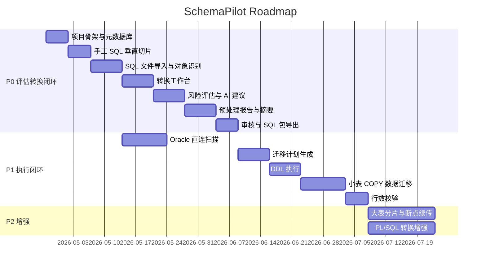

# SchemaPilot 实施计划

## 1. 总体策略

不要一开始就做“大而全迁移执行器”。正确路线是先做一个完整闭环：

```text
输入 SQL / 扫描 Oracle
  -> 识别对象
  -> 转换
  -> 风险评估
  -> AI 解释和改造建议
  -> 预处理报告
  -> 审核
  -> 导出 PostgreSQL SQL 包
```

这个闭环跑通后，再接数据迁移执行和校验。否则会很容易卡在 PL/SQL、package、大表性能这些深坑里，看起来功能很多，但没有一个环节足够可信。

### 1.1 闭环交付原则

每个阶段必须满足五件事：

- 有入口：用户知道从哪里开始。
- 有过程：平台能展示当前状态、问题和下一步。
- 有产物：必须生成可保存、可审计、可下载或可执行的结果。
- 有门禁：关键动作不能绕过审核、基线和权限。
- 有回流：失败、差异、人工修改能回到前面的工作台继续处理。

## 2. 阶段划分

### P0：能演示的评估转换闭环

目标：让用户看到平台价值，而不是只看到空页面。

范围：

- 项目管理。
- Oracle/PostgreSQL 数据源连接测试。
- SQL 文件上传。
- 手工 SQL 输入。
- SQL/PLSQL 对象识别。
- 表、字段、索引、sequence、简单 view 转换。
- trigger/function/procedure/package 风险识别。
- AI 风险解释、SQL 改造建议、报告摘要。
- 转换工作台。
- 预处理报告。
- 审核流程。
- SQL 包导出。

不包含：

- 全量数据迁移。
- 复杂 package 自动转换。
- 迁移后校验。

### P1：结构执行和基础数据迁移

目标：从“评估转换平台”进入“可执行迁移平台”。

范围：

- 迁移计划生成。
- PostgreSQL DDL 执行。
- 小表数据迁移。
- PostgreSQL COPY 写入。
- 任务进度。
- 失败重试。
- 行数校验。

### P2：高速迁移和复杂对象增强

目标：处理真实大库、大表、复杂 PL/SQL。

范围：

- 大表分片。
- 断点续传。
- 并发限流。
- checksum 校验。
- trigger 草稿增强。
- function/procedure 草稿增强。
- package 拆解建议。
- AI 规则建议和执行错误诊断。
- 报告导出 PDF/Word/Excel。

### P3：企业化和分布式

目标：支持团队协作和更大规模任务。

范围：

- 多角色权限。
- 多级审批。
- Worker 节点。
- Redis/队列。
- MinIO 文件存储。
- 迁移模板。
- 规则市场。
- 审计报表。

## 2.1 闭环里程碑矩阵

| 阶段 | 闭环名称 | 用户入口 | 核心产物 | 门禁 | 验收方式 |
|---|---|---|---|---|---|
| P0 | 评估转换闭环 | 手工 SQL、SQL 文件 | 对象清单、转换结果、风险、报告、SQL 包 | 审核通过才能导出正式包 | 用 3 个样例 SQL 跑通端到端 |
| P1 | 执行校验闭环 | 已审核 SQL 基线、Oracle/PG 数据源 | 迁移计划、执行日志、行数校验报告 | 已审核基线才能执行 | 在测试库执行建表和小表 COPY |
| P2 | 高速恢复闭环 | 大表迁移任务 | shard checkpoint、失败重试、checksum | 失败 shard 必须处理或豁免 | 人为中断后恢复并校验通过 |
| P2 | 规则沉淀闭环 | 人工修正 SQL、AI 建议 | 新规则草案、规则测试结果 | 人工确认后规则才生效 | 同类 SQL 再次导入能自动命中 |
| P3 | 治理闭环 | 多项目、多角色 | 审批流、审计报表、模板 | 权限和审批策略 | 不同角色完成协作验收 |

## 3. 第一条垂直切片

第一条垂直切片建议只选一个输入：

```sql
CREATE TABLE users (
  id NUMBER(19) PRIMARY KEY,
  name VARCHAR2(100),
  created_at DATE DEFAULT SYSDATE
);
```

必须跑通：

```text
手工输入
  -> 解析成 DbObject
  -> 类型映射
  -> 生成 PostgreSQL SQL
  -> 标记 DATE / SYSDATE 风险
  -> AI 解释风险并给出改造建议
  -> 展示转换工作台
  -> 生成预处理报告
  -> 审核通过
  -> 导出 SQL
```

这条链路小，但它会逼着核心模型、状态机、转换结果、风险、报告、审核都先定下来。

第一条垂直切片的验收产物：

- `InputSource`：保存手工 SQL 原文。
- `DbObject`：识别出 `users` 表。
- `ConversionResult`：生成 PostgreSQL 建表 SQL。
- `RiskIssue`：标记 `DATE` 和 `SYSDATE` 风险。
- `AiSuggestion`：解释风险并给出改造建议。
- `EditedSqlVersion`：用户确认或修改目标 SQL。
- `PrecheckReport`：报告引用当前 SQL 版本。
- `ReviewRecord`：审核通过。
- `SqlPackage`：导出的 PostgreSQL SQL 包。

验收失败标准：

- 原始 SQL 丢失。
- 报告没有引用转换结果版本。
- AI 建议直接覆盖目标 SQL。
- 未审核也能导出正式包。
- 修改目标 SQL 后报告没有过期提示。

## 4. 里程碑计划



日期只是当前项目的规划占位，实际排期按团队人数调整。

## 5. 技术预研必须先做

这些预研要优先做，否则后面会返工：

### 5.1 SQL/PLSQL 切分预研

验证点：

- 普通 SQL 用 `;` 切分。
- `CREATE TRIGGER ... BEGIN ... END; /` 不被错误切开。
- `CREATE PACKAGE BODY` 能整体识别。
- Data Pump SQLFILE 中的特殊语句能跳过或标风险。

输出：

- statement splitter 原型。
- 解析 fixture。
- 不支持样例清单。

### 5.2 Oracle 元数据采集预研

验证点：

- 普通账号能看到哪些 `ALL_*` 视图。
- 是否需要 `SELECT_CATALOG_ROLE`。
- `DBMS_METADATA` 输出是否稳定。
- PL/SQL 源码能否从 `ALL_SOURCE` 拿到。

输出：

- 最小权限清单。
- 扫描 SQL 清单。
- 权限不足时的降级策略。

### 5.3 COPY 性能预研

验证点：

- Java 25 虚拟线程 + pgJDBC CopyManager 是否稳定。
- 不同 batch buffer 大小的吞吐。
- FFM 堆外 COPY 编码缓冲是否能降低 GC 压力。
- LOB 字段吞吐。
- NULL 和空字符串编码策略。

输出：

- COPY writer 原型。
- FFM buffer 原型。
- 性能基准。
- 默认参数建议。

### 5.4 虚拟线程限流预研

验证点：

- Hikari 连接池等待行为。
- 大量虚拟线程等待 JDBC 时的表现。
- `synchronized` 或驱动 native 调用导致 pinning 的风险。

输出：

- 全局并发控制组件。
- shard semaphore 原型。
- 监控指标。

### 5.4.1 FFM 内存控制预研

验证点：

- `Arena` 生命周期是否能和 task / shard 生命周期绑定。
- `MemorySegment` 编码缓冲是否适合 COPY 行序列化。
- pgJDBC CopyManager 边界是否需要 `byte[]` 复制，以及复制成本。
- 大 SQL 文件分块解析是否能使用 FFM 降低 heap 占用。
- LOB 分块读取和写入的最佳 buffer size。
- 内存预算耗尽时如何触发任务限流，而不是 OOM。

输出：

- `MemoryBudgetManager` 原型。
- `FfmBuffer` / `CopyBuffer` 原型。
- shard arena 生命周期测试。
- 堆内 vs 堆外 COPY 压测报告。
- 默认堆外内存预算建议。

### 5.5 AI 集成预研

验证点：

- AI Provider 抽象是否能同时支持云端模型、本地模型和 mock。
- 提示词中是否能稳定注入对象、风险、转换结果上下文。
- 是否能在不泄露数据库密码、连接串、密钥的情况下生成有效建议。
- AI 建议是否能结构化保存、接受、忽略、编辑和审计。
- 长 PL/SQL 对象如何分块摘要，避免超出上下文。
- pgvector + Spring AI VectorStore 是否能满足第一版知识库检索。
- 知识 chunk 的 metadata filter 是否能按对象类型、风险类型、版本过滤。
- embedding 生成前的脱敏策略是否可靠。
- Spring AI MCP Java SDK 是否适合暴露 SchemaPilot tools/resources/prompts。
- AgentRuntime 是否能用轻量状态机满足暂停、重试、审计。
- Skill 包是否能通过 YAML + Java handler + fixture 的方式版本化。

输出：

- `AiProvider` 原型。
- 提示词模板版本机制。
- 脱敏工具。
- AI 建议数据模型。
- AI 成本和调用日志模型。
- 知识库表结构原型。
- pgvector 检索原型。
- RAG 上下文拼装原型。
- MCP Server 原型。
- AgentRuntime 原型。
- SkillRegistry 原型。

## 6. P0 详细步骤

### Step 1：项目骨架

交付：

- `backend/` Spring Boot。
- `frontend/` React。
- PostgreSQL 元数据库。
- Flyway/Liquibase。
- 健康检查接口。
- 前端基础布局。

验收：

- 前后端能启动。
- 前端能调用后端。
- 数据库迁移脚本能执行。

### Step 2：手工 SQL 垂直切片

交付：

- manual input API。
- statement splitter 初版。
- `CREATE TABLE` 分类。
- `DbObject` 落库。
- `ConversionResult` 落库。
- 简单类型映射。
- 风险识别。

验收：

- 输入一段 Oracle 建表 SQL，能生成 PostgreSQL SQL。
- 页面能看到原 SQL、目标 SQL、风险。

### Step 3：SQL 文件导入

交付：

- 文件上传。
- 文件 checksum。
- 文件解析任务。
- 多语句对象识别。
- 解析错误记录。

验收：

- 上传 SQL 文件后能看到对象清单。
- 解析失败的语句不会丢失。

### Step 4：转换工作台

交付：

- Monaco 左右编辑器。
- SQL diff。
- 风险面板。
- 手工编辑目标 SQL。
- 目标 SQL 版本保存。

验收：

- 用户可以修改转换结果。
- 修改后的 SQL 成为导出和执行基线。

### Step 5：AI 副驾驶 MVP

交付：

- AI Provider 抽象。
- mock provider，方便无密钥环境开发。
- 提示词模板。
- 上下文构建器。
- 风险解释。
- SQL 改造建议。
- PL/SQL 草稿说明。
- 轻量知识库检索接口。
- AgentRuntime 轻量状态机。
- SkillRegistry。
- 内置前 3 个 Skill。
- MCP tools/resources/prompts 原型。
- 用户接受/忽略 AI 建议。
- AI 调用审计。

验收：

- 用户能在转换工作台点击“解释风险”。
- 用户能对单个对象生成“改造建议”。
- AI 建议不会自动覆盖目标 SQL。
- 接受 AI 建议会留下审计记录。
- AI 回答能显示使用的知识片段来源。
- Agent 每一步都有状态和审计。
- Skill 输出符合 schema。
- MCP tool 调用有 allowlist、超时和日志。

### Step 6：风险和预处理报告

交付：

- 风险规则。
- 兼容性评分。
- 报告快照。
- 报告详情页。
- AI 报告摘要。

验收：

- 报告能显示资产统计、风险列表、类型映射、建议处理。
- 报告能生成 AI 摘要，但结论仍以规则和审核为准。
- 修改对象后报告能标记过期。

### Step 7：审核和导出

交付：

- 审核提交。
- 审核通过/驳回。
- 审核记录。
- SQL 包导出。

验收：

- 未审核不能导出正式执行包。
- 审核通过后能导出 PostgreSQL SQL。

### Step 8：P0 闭环回归

交付：

- 端到端演示样例。
- P0 回归脚本或手工验收清单。
- 报告过期检测。
- 基线冻结检测。
- AI 建议审计检测。

验收：

- 从输入 SQL 到导出 SQL 包能连续跑通。
- 修改转换结果后，旧报告变为过期。
- 重新生成报告后可以再次提交审核。
- 未审核状态下导出被拒绝。
- 所有关键动作能在审计日志中看到。

## 7. P1 详细步骤

### Step 1：Oracle 直连扫描

交付：

- 数据源连接测试。
- schema 扫描。
- 对象采集。
- PL/SQL 源码采集。
- 扫描进度。

验收：

- 指定 schema 能扫描出对象清单。
- 权限不足有明确提示。

### Step 2：迁移计划

交付：

- 计划生成。
- 依赖排序。
- 执行模式选择。
- DDL 预览。

验收：

- 计划步骤清晰可查看。
- 审核未通过无法生成正式计划。

### Step 3：DDL 执行

交付：

- PostgreSQL 执行器。
- 执行日志。
- 失败捕获。
- 单步重试。

验收：

- 能把转换后的表结构执行到 PostgreSQL。

### Step 4：基础数据迁移

交付：

- Oracle streaming reader。
- PostgreSQL COPY writer。
- FFM COPY 编码缓冲。
- 堆外内存预算控制。
- 小表迁移。
- 进度推送。

验收：

- 小表能完成端到端迁移。
- 迁移速度和行数可见。
- COPY 过程中 heap 占用稳定。
- shard 结束后 arena 能释放。

### Step 5：P1 执行校验闭环回归

交付：

- 测试 Oracle 源表到 PostgreSQL 目标表的执行样例。
- DDL 执行日志。
- COPY 数据迁移日志。
- 行数校验报告。
- 失败回流问题单。

验收：

- 只能从已审核 SQL 基线生成迁移计划。
- DDL 成功后目标库能看到对象。
- 小表 COPY 后源和目标行数一致。
- 人为制造 DDL 错误时，错误能定位到对象和 SQL。
- 校验失败时能生成待处理问题，并回到转换或计划阶段。

## 8. P2 详细步骤

重点做真实生产能力：

- 大表分片。
- checkpoint。
- 失败 shard 重试。
- 断点续传。
- checksum。
- LOB 优化。
- 并发参数面板。
- package 分析增强。
- trigger/function/procedure 草稿增强。

## 9. 关键验收标准

P0 验收：

- 可以从手工 SQL 和 SQL 文件生成对象清单。
- 可以转换常见 DDL。
- 可以识别 PL/SQL 风险。
- 可以让 AI 解释风险并生成改造建议。
- 可以生成预处理报告。
- 可以审核。
- 可以导出 SQL 包。

P1 验收：

- 可以直连 Oracle 扫描。
- 可以执行结构迁移。
- 可以迁移小表数据。
- 可以查看进度和失败原因。
- 可以做行数校验。

P2 验收：

- 大表可以分片迁移。
- 任务可恢复。
- 支持强校验。
- PL/SQL 改造建议有实用价值。

## 10. 版本建议

| 版本 | 目标 |
|---|---|
| 0.1 | 项目骨架、手工 SQL 转换闭环 |
| 0.2 | SQL 文件导入、对象清单 |
| 0.3 | 转换工作台、风险识别 |
| 0.4 | AI 副驾驶 MVP |
| 0.5 | 预处理报告、审核 |
| 0.6 | Oracle 直连扫描 |
| 0.7 | 迁移计划、SQL 包导出 |
| 0.8 | DDL 执行 |
| 0.9 | COPY 小表数据迁移 |
| 0.10 | 大表分片、断点续传 |
| 1.0 | 评估、审核、执行、校验完整闭环 |

## 11. 暂缓事项

这些不要第一版就做：

- 微服务拆分。
- 在线 CDC。
- `.dmp` 二进制解析。
- 全自动 package 转换。
- AI 自动执行 SQL。
- AI 自动替代审核。
- 复杂报表导出。
- 多租户计费。

先把迁移评估和转换审核做成可信工具，再扩成完整迁移平台。
